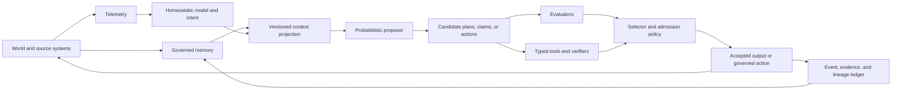

# Emergent Reasoning in Large Language Models

## Constraint-Conditioned Traversal, Soft Unification, and Candidate Markov Objects

**Dimitar Popov**
**Version 4.0 - research draft, 12 July 2026**

## Abstract

Large language models exhibit constraint-sensitive, compositional, and
reasoning-like behaviour despite being trained as probabilistic sequence
models. The first public version of this paper, released in July 2025,
proposed that this behaviour can be understood as context-conditioned
computation over learned representational structure. It described attention
as a form of soft unification, argued that reasoning can require extended
computational traversal, and proposed that stable proto-symbolic regions may
possess Markov-blanket-like boundaries. This version retains that thesis while
correcting its mechanics and repricing its empirical status.

A transformer forward pass acts on the full residual-state tensor, through
layer-specific attention, multilayer perceptron, normalization, and residual
maps. It is therefore not literally an autonomous flow over one semantic
vector, and attention alone is not a logic engine. Four axes must also be kept
separate: layer depth within a forward pass, autoregressive token generation,
latent or recurrent test-time computation, and training-time parameter
change. Within those limits, constraint-conditioned traversal and soft
unification remain useful operational hypotheses: context changes which
relations are active, graded matching supports partial binding, and further
structured computation can improve the transformation of a problem state.

The paper reports the complete internal Markov-object experiment ledger rather
than selecting only positive results. Experiments on GPT-2 small, Pythia-160M,
and selected Llama-3 8B surfaces find context-sensitive core/coat structure,
layer-coherent identity directions, causal intervention effects, a positive
compositional direction result, and limited cross-model replication. They also
find that sparse-autoencoder partitions leak, low-rank charts do not exhaust
identity, single- and multi-layer conditional-independence proxies fail,
static graph-cut and causal-faithfulness gates fail, and one tested dynamical
blanket formulation fails. The evidence supports coherent distributed
semantic structure and candidate object charts. It does not establish a
formal Markov blanket.

Recent Jacobian-lens work supplies an important external convergence result. A
small, causally privileged J-space supports report, directed modulation,
flexible reuse, and unspoken intermediate reasoning while much automatic
processing bypasses it. This is strong evidence for a context-sensitive
workspace chart, not for conditional independence: a broadcast workspace and
a Markov blanket are different topologies.

The resulting programme has two levels. Attribution graphs can generate
representational boundary hypotheses, and J-space charts can generate
workspace-mediation hypotheses. Both must be tested against matched chart
controls and interventions. The semantic construct must separately pass
behavioural carrier-invariance, boundary, composition, cross-architecture, and
adversarial tests. This distinction preserves the original proposal while
making it possible to lose: failed chart tests demote a chart; broad failure
of behavioural assurance weakens or removes the candidate object. The paper
closes by deriving architectural consequences for hybrid reasoning systems in
which language models propose, typed tools and verifiers constrain, governed
memory supplies versioned context, and intent and action authority remain
separate from the model by default.

## Reading Contract

This is a research framework with empirical exposure. It is not a claim about
consciousness, understanding, or general intelligence. It does not treat the
Constraint-Emergence Ontology as evidence that a corresponding mechanism
exists in a language model. The ontology supplies a vocabulary and a set of
candidate abstractions; transformer mechanics, experiments, and external
studies decide how far those abstractions travel.

Six epistemic labels are used throughout:

- **Assumption**: a premise adopted to define a model or experiment.
- **Derived-within-framework**: a consequence of declared premises, not an
  independently established fact about a model.
- **Empirical finding**: a result supported by a cited observation or executed
  experiment, within its stated population and instrument.
- **Conjecture**: a claim that remains open and has not passed its promotion
  conditions.
- **Interpretive stance**: a useful reading compatible with evidence but not
  independently selected by it.
- **Open exposure**: an operational test with declared success and losing
  conditions.

These labels are intentionally narrower than the vocabulary used in the
previous draft. In particular, no mathematical treatment of an approximation
is allowed to turn an interpretive stance into a discovered language-model
mechanism by declaration.

## 1. Research Question, Scope, and Public Lineage

### 1.1 The research question

Language models can solve some multi-step problems, bind entities and roles,
transfer relational patterns, satisfy local constraints, use intermediate
work, and produce code or mathematics that passes external checks. These
behaviours do not imply that a transformer contains a conventional symbolic
interpreter. They do require an account more precise than either "it is only
next-token prediction" or "symbols simply emerge."

The question of this paper is:

> What learned structure and computation permit a probabilistic transformer
> to exhibit context-sensitive, symbolic-like, and reasoning-like behaviour,
> and what evidence would distinguish that account from weaker alternatives?

The question has three parts. The first is mechanical: what state is updated,
and along which computational axes? The second is representational: what kind
of stable structure, if any, supports partial binding and composition? The
third is architectural: which assurance properties can the language model
provide itself, and which require memory, tools, verifiers, or governing
authority outside it?

Reasoning is not defined here by a benchmark label or by the presence of a
written chain of thought. Operationally, a system performs a reasoning-like
computation when it transforms a represented problem through intermediate,
constraint-sensitive states such that the transformation supports systematic
success, intervention-sensitive causal structure, or lawful generalization.
This definition admits several implementations and does not assume that every
correct answer results from the same internal process.

### 1.2 Public lineage

The priority record matters because this paper combines an original thesis,
later internal experiments, and external work published both before and after
the thesis.

1. **Version 1.0**, represented in this repository by
   [`archive/EmergentReasoning_04.md`](archive/EmergentReasoning_04.md), was
   published on 30 July 2025 as
   [Zenodo record 16592400](https://doi.org/10.5281/zenodo.16592400). It
   introduced the public claims that attention supports context-sensitive soft
   unification, that the relevant logical structure is local and dynamic rather
   than one monolithic topology, that fuzzy proto-symbolic boundaries may form,
   and that reliable systems should combine learned generation with explicit
   constraints and modular components.
2. **Version 3.0**, represented by
   [`emergent_reasoning_v3.md`](emergent_reasoning_v3.md), was published on 16
   February 2026 as
   [Zenodo record 18653552](https://doi.org/10.5281/zenodo.18653552). It
   sharpened the traversal formalism, connected proto-symbols to the
   Markov-object conjecture, distinguished reasoning traversal from
   verbalization traversal, expanded the hallucination taxonomy, and connected
   the paper to the Constraint-Emergence Ontology.
3. **Version 4.0** is this research draft. It incorporates the executed
   Markov-object programme, corrects the overclaims in the earlier v4 draft,
   separates representational charts from semantic objects, and defines a
   two-level successor exposure programme. Until this draft is accepted and
   published, v3 remains the latest published cut.

The Zenodo concept record is
[16592399](https://doi.org/10.5281/zenodo.16592399). A later version does not
move a claim's first public date backwards. Likewise, an earlier external
paper is an antecedent or source of convergence, not a fulfilment of a later
prediction. This draft therefore distinguishes four relationships to outside
work: **antecedent**, **convergence**, **later support**, and
**contradiction or reprice**.

The public record is not the whole development record. The author dates the
initial formulation of most of the v1 thesis to the approximately six-month
period preceding publication. This repository was created as a publishing
surface, not as the working research history, so its commit dates do not
independently timestamp each intermediate formulation. Accordingly, work
published before 30 July 2025 can be both a **public antecedent** and an
instance of **independent conceptual convergence**. This paper records that
convergence without claiming an earlier public priority date than the evidence
supports.

### 1.3 What remains original

Soft unification itself predates this paper. Neural theorem provers and
unification networks already used differentiable similarity to relax symbolic
matching (Rocktaschel and Riedel 2017; Cingillioglu and Russo 2019). Dynamical
and geometric analyses of transformers also predate the public v1. The owned
contribution is narrower and more specific:

- applying soft-unification language to ordinary transformer attention as one
  part of context-conditioned relational binding, without requiring an
  installed logic programme;
- replacing one global logical topology with overlapping, context-activated
  local structures;
- linking those structures to fuzzy proto-symbolic boundaries and then to an
  explicit Markov-object conjecture;
- treating longer visible or latent computation as extended structured
  traversal rather than identifying reasoning with verbal output;
- deriving a modular architecture in which learned generation, constraints,
  memory, verification, intent, and action authority remain distinct.

These are hypotheses and synthesis claims. Their value depends on the
discriminating tests they generate, not on the vocabulary alone.

### 1.4 Scope and non-claims

This paper addresses learned representations, computation, and system design.
It does not claim:

- that every successful model answer reflects a unified reasoning mechanism;
- that attention weights by themselves provide a faithful explanation;
- that representations occupy a smooth manifold in the strict differential-
  geometric sense at every scale;
- that any current sparse-autoencoder feature or attribution-graph node is a
  semantic object;
- that conditional independence has been established for a candidate object;
- that scaling parameters monotonically improves reasoning or screening;
- that a language model has persistent intent merely because it emits
  goal-directed text.

The term **semantic geometry** is used as a neutral shorthand for measurable
relations among representations. When a smooth-manifold assumption is needed,
it is stated as an assumption and tested through consequences rather than
smuggled in as a fact.

## 2. Transformer State, Update Maps, and Four Time Axes

### 2.1 The state is a tensor, not a single semantic point

For a sequence of length \(n\) and residual width \(d\), let

\[
X_l \in \mathbb{R}^{n \times d}
\]

denote the residual state entering layer \(l\). Each row is associated with a
context position, but the state of the forward pass is the whole tensor.
Suppressing implementation details, a pre-normalization transformer block can
be written as

\[
Y_l = X_l + A_l(N^A_l(X_l); m),
\]

\[
X_{l+1} = Y_l + M_l(N^M_l(Y_l)),
\]

where \(A_l\) is multi-head attention, \(M_l\) is the multilayer perceptron,
\(N^A_l\) and \(N^M_l\) are normalization maps, and \(m\) includes the
attention mask. Equivalently,

\[
X_{l+1} = F_l(X_l; \theta_l, m).
\]

The subscript on \(F_l\) is load-bearing. Layers generally have different
parameters, so the ordinary transformer is a composition of non-identical
maps, not an autonomous recurrence under one fixed vector field. A residual
update can be studied with dynamical-systems tools, and continuous-depth
limits can be mathematically useful, but

\[
x_{t+1} = x_t + \Delta t D(x_t,c)
\]

is an approximation or interpretive model, not a literal identity for the
machine as a whole.

At one attention head,

\[
Q=XW_Q, \quad K=XW_K, \quad V=XW_V,
\]

\[
A(X)=\operatorname{softmax}\left(\frac{QK^\top}{\sqrt{d_h}} + m\right)V.
\]

This operation computes graded, context-dependent aggregation. It is central
to relational selection, but the block output also depends on value
projections, head composition, MLP transformations, normalization, residual
history, and later layers. Claims about a semantic update must therefore be
made at the block or network level unless an intervention isolates a smaller
mechanism.

### 2.2 Four distinct axes

Earlier versions compressed several forms of change into one trajectory.
That shorthand concealed different mechanisms and led to claims stronger than
the machine supports. This paper separates four axes.

#### Layer depth

The index \(l\) tracks transformations within one forward pass:

\[
X^{(k,r,s)}_{l+1}=F^{(s)}_l(X^{(k,r,s)}_l).
\]

This is a finite, parameter-heterogeneous composition. Information can be
assembled, transformed, routed, or made linearly readable at different layers.
Layerwise similarity does not by itself imply that one persistent object has
travelled unchanged through the network.

#### Autoregressive token generation

The index \(k\) tracks repeated forward passes as generated tokens are appended
to context:

\[
y_k \sim p_{\theta^{(s)}}(\cdot \mid y_{<k}, x),
\]

\[
X^{(k+1)}_0 = E(x,y_{\leq k}).
\]

A written chain of thought can add computation because each emitted token
changes the next call's context and residual state. This axis includes a
sampling or decoding decision and cannot be reduced to depth within one pass.

#### Latent or recurrent test-time computation

The index \(r\) tracks architectures that iterate a hidden state or reuse a
block without necessarily emitting a token:

\[
H_{r+1}=R(H_r; x,\theta).
\]

Coconut and recurrent-depth systems instantiate different versions of this
idea. They provide additional computation without requiring every
intermediate state to be verbalized. The recurrent map may be fixed across
steps in a way that ordinary transformer layers are not.

#### Training time

The index \(s\) tracks parameter updates:

\[
\theta^{(s+1)}=\theta^{(s)}+\Delta\theta^{(s)}.
\]

Pretraining, supervised fine-tuning, reinforcement learning, and preference
optimization change future update maps. They do not merely move one inference
trajectory through an unchanged space. Geometric language such as "deepening
a basin" may summarize an observed behavioural effect, but it requires a
separate representational measurement before it can be asserted as a training
mechanism.

### 2.3 What the dynamical lens contributes

Geshkovski, Letrouit, Polyanskiy, and Rigollet (2023; 2025) develop a
mathematical treatment of self-attention as an interacting-particle system and
analyze clustering and related dynamics. Fernando and Guitchounts (2025)
analyze transformer residual trajectories and report curved and
attractor-like behaviour, especially in lower layers. These are important
antecedents and sources of convergence. They establish that dynamical-systems
questions are mathematically and empirically productive. They do not establish
that a whole model follows one semantic vector field, that clustering equals
symbolic reasoning, or that a particular semantic manifold has been recovered.

The defensible stance is therefore:

> **Interpretive stance.** A transformer can be studied as a sequence of
> state transformations whose local geometry and longer trajectories may
> reveal structured computation. The exact semantic state variables and their
> dynamical closure remain empirical questions.

This stance is weaker than the previous draft's literal direction-field claim
and stronger methodologically because it exposes the choice of state,
projection, and time axis.

## 3. The Original Thesis: Constraint-Conditioned Soft Unification

### 3.1 From context to graded relational binding

A prompt changes more than the probability of its next token. It changes which
entities, attributes, roles, temporal relations, discourse commitments, and
task rules are relevant to subsequent computation. Attention is one mechanism
by which positions query and aggregate information from other positions. Its
similarity scores are graded rather than Boolean, multiple heads can support
different relations, and the resulting values are transformed and composed
through later blocks.

The v1 paper called this process **soft unification**. In this version the term
has a precise, bounded meaning:

> **Soft unification** is context-conditioned, graded relational matching and
> binding in which candidate correspondences can be partially active,
> simultaneously represented, and revised by subsequent computation.

It is an operational hypothesis, not a declaration that attention executes
Prolog. Classical first-order unification searches for a substitution that
makes terms identical under discrete syntax. Transformer attention computes
similarity-weighted aggregation over learned vectors. It has no native occurs
check, no guarantee of a most general unifier, no built-in variable scope, and
no necessary backtracking semantics. The resemblance lies in the functional
problem of binding relational roles under constraints, not in implementation
equivalence.

This distinction also prevents a second error: treating softmax as if it
"enforces" logical constraints. A high attention score routes influence; it
does not certify that the selected relation is true. The resulting constraint
sensitivity is distributed across attention, MLPs, residual composition,
training-induced representations, decoding, and any external tools.

### 3.2 Constraint satisfaction as a bounded abstraction

The first public paper used constraint satisfaction problems to explain how a
large possibility space can be narrowed by relations that must jointly hold.
The abstraction remains useful if its limits are explicit. In a classical CSP,
variables, domains, and constraints are declared, and a solution either
satisfies the constraint set or does not:

\[
\mathcal{S}=\{z\in\mathcal{Z}: C_1(z)\land\cdots\land C_m(z)\}.
\]

A language model ordinarily produces a distribution over continuations rather
than this certified feasible set. Prompt content, learned parameters,
attention, intermediate tokens, and tool results can all change the relative
mass assigned to continuations, but low probability is not logical exclusion
and high probability is not satisfaction proof.

The defensible correspondence is functional:

- pretraining installs learned regularities that act like persistent soft
  constraints;
- context activates and combines a local subset of those regularities;
- intermediate computation can propagate implications or conflicts;
- decoding selects from the resulting distribution;
- an external checker may certify a declared hard property.

This distinction separates **constraint-conditioned generation** from a
literal CSP solver. It also explains why explicit symbolic or typed components
remain useful: they can turn selected conditions from graded model pressure
into inspectable pass/fail contracts.

The original paper also observed that probabilistic implementation does not
settle whether a system performs structured computation. Biological and
electronic systems both operate under noise while supporting stable higher-
level functions. That observation defeats the argument "probabilistic,
therefore incapable of reasoning," but it supplies no positive evidence that
an LLM reasons like a brain. Positive evidence must come from behavioural
generalization, causal mechanism, and external checks.

### 3.3 Local structure rather than one logical topology

The original paper rejected the idea that an LLM reasons inside one globally
unified logical space. The same representation can participate in different
relations under different prompts. A token denoting a bank can be constrained
by finance, geography, law, or river morphology; a date can denote execution,
observation, legal effectiveness, fixing, settlement, or correction depending
on its syntactic and operational role. Labels alone do not determine meaning.
Contextual use does.

Let \(C\) be a context population and let \(R_c\) denote the set of relational
dependencies active enough to affect a declared readout under context \(c\).
The claim is not that each \(R_c\) is a complete logical theory. It is that
reasoning-like behaviour depends on overlapping local structures:

\[
R_{c_1} \neq R_{c_2}, \qquad
R_{c_1} \cap R_{c_2} \neq \varnothing
\]

for many related contexts. Locality is therefore context-relative and can be
task-relative. A useful topology may be a family of charts over an ambient
state space rather than one smooth global manifold.

This position has practical consequences. A probe trained on one prompt
template may recover the template rather than the relation. A feature found at
one layer may be one chart of a distributed computation. A model can implement
the same behavioural relation through different carriers across contexts or
architectures. Tests must vary the surface carrier while preserving the
claimed semantics.

### 3.4 Prior art and convergence

Differentiable unification is established prior art. Neural theorem provers
relaxed symbolic matching with learned similarities (Rocktaschel and Riedel
2017), and later work explicitly studied learning invariants through soft
unification (Cingillioglu and Russo 2019). Those systems install more symbolic
structure than an ordinary language model. They show that graded matching can
support rule-like computation; they do not show that generic transformer
attention has learned the same mechanism.

Yang et al. (2025) identify an interpretable sequence of mechanisms supporting
abstract symbolic reasoning: early abstraction, middle-layer symbolic
induction, and later retrieval. This work predates the public v1 release and is
therefore an antecedent, not a fulfilled prediction. It converges directly on
the transformer-specific proposition that role abstraction and relational
matching can be learned and distributed across stages. It also sharpens the
test: a soft-unification account should identify binding-sensitive causal
signatures that generalize across surface substitutions, not merely semantic
similarity or token co-occurrence.

### 3.5 The current claim

The original thesis survives in this bounded form:

> **Conjecture.** Some transformer computations implement
> context-conditioned, graded binding over learned relational structure. This
> supports symbolic-like behaviour without requiring a globally explicit
> symbolic programme.

The claim would weaken substantially if binding-sensitive interventions could
not be separated from generic information mixing, if apparent role structure
failed under carrier-preserving substitutions, or if simpler memorization and
template accounts explained the same causal results.

## 4. Reasoning as Extended, Structured Computation

### 4.1 Traversal without the single-trajectory fiction

The useful insight behind "reasoning as traversal" is not that every model has
one hidden path through a canonical manifold. It is that difficult
transformations may require intermediate computation whose order and content
are constrained by the problem. The relevant trajectory may run through
layerwise states, autoregressively externalized tokens, recurrent latent
states, tool results, or a combination of these.

For a problem instance \(q\), let

\[
S_0(q), S_1(q), \ldots, S_T(q)
\]

be an instrument-relative sequence of intermediate states. This sequence
counts as structured computation only when at least one of the following is
shown:

- intermediate states causally affect the result under intervention;
- the sequence preserves and updates task constraints in a systematic way;
- added steps improve performance under controls for mere token or sampling
  budget;
- the same relational computation generalizes across carriers or instances;
- an external checker validates intermediate or final properties.

Length alone is not reasoning. A verbose answer may contain no useful
intermediate work, while a short answer may result from a compact learned
algorithm. "Extended traversal" names additional structured transformation,
not additional prose.

### 4.2 Visible chain of thought

Chain-of-thought prompting can extend computation through the autoregressive
axis. Each intermediate token becomes part of the next context and can act as
external working memory. Feng et al. (2023), Goyal et al. (2024), Snell et al.
(2024), and a large subsequent literature show that intermediate tokens and
test-time compute can improve some reasoning tasks.

Three qualifications are necessary.

First, improvement does not prove that the written chain faithfully reports
the internal cause of the answer. Section 8 treats this separately. Second,
extra samples, longer sequences, and better selection can all increase test-
time compute; they need not instantiate the same mechanism. Third, a result on
one model family or task does not show that computation universally substitutes
for parameter scale.

### 4.3 Latent and recurrent computation

Coconut (Hao et al. 2024) feeds continuous hidden states forward as latent
reasoning states rather than forcing every step through a discrete token.
Recurrent-depth work (Geiping et al. 2025) repeatedly applies learned
computation at inference time. The latent-reasoning survey (2025) organizes a
broader field of methods that allocate intermediate computation outside a
fully verbal chain.

These systems are **public antecedents and independent convergence** with the
pre-public formulation of the broad traversal thesis: useful intermediate
computation can occur in continuous or recurrent carriers and can be expanded
at test time. They predate the public v1 cut and are not fulfilled public
predictions of it. They do not prove that the same latent state variable or
geometry is used by ordinary chain-of-thought models. They instead force a
better taxonomy:

| Compute extension | State carrier | Step transition | Observable by default |
|---|---|---|---|
| Written chain of thought | tokens plus residual state | new autoregressive call | tokens only |
| Latent reasoning | continuous hidden state | architecture-specific recurrence | no |
| Recurrent depth | recurrent block state | repeated block application | no |
| Sampling and selection | candidate outputs | independent or branched calls | candidates |
| Tool-augmented reasoning | model state plus tool state | typed invocation and return | tool boundary |

The table matters because a behavioural gain shared across these methods
supports the value of additional computation but not one common internal
mechanism.

### 4.4 Capacity, scale, and compute

The earlier claim that depth, "and never parameter count," is the reasoning
resource is too strong. Parameters shape the functions available at each
step, the information represented, the quality of intermediate states, and
the ability to use added compute. Test-time compute and model capacity can be
complements, substitutes in bounded regimes, or bottlenecks for one another.

The current claim is:

> **Empirical finding.** Additional structured test-time computation improves
> performance for some models and tasks. **Conjecture.** The gain depends on
> whether the learned update maps can preserve and transform the task's
> relevant constraints across those additional steps.

The conjecture loses explanatory value if matched additional steps improve
equally when their intermediate states are randomized, causally disconnected,
or replaced by budget-equivalent sampling that contains no corresponding
state transformation.

## 5. Proto-Symbols and the Candidate Markov-Object Hypothesis

### 5.1 Proto-symbols

The original paper used **proto-symbol** for a learned semantic pattern that
behaves enough like a symbol to support stable reference, role binding, or
composition without being a discrete symbolic token installed by a designer.
This version defines a proto-symbol through observable properties rather than
through a visual cluster:

> A proto-symbol is a context-conditioned semantic pattern that is sufficiently
> stable across an explicitly declared carrier set, sufficiently distinct
> under semantic boundary changes, and sufficiently causally load-bearing to
> support systematic behaviour.

This definition is scale-relative and task-relative. The carrier may be a
distributed direction family, an activation subspace, a dynamical pattern, a
circuit, or a pattern that only becomes stable at the behavioural interface.
No one instrument is privileged in advance.

### 5.2 Object, chart, and feature

Three levels must be separated.

1. The **semantic object** \(O\) is the substrate-neutral construct claimed to
   preserve some meaning or relation across admissible carriers.
2. A **representational chart** \(\phi_j(O)\) is an instrument-relative
   projection of that construct into a measured space, such as an SAE feature
   ensemble, a mean-difference direction, a layerwise subspace, a J-lens
   coordinate, an attribution subgraph, or a behavioural readout.
3. An **instrument feature** is one coordinate or node produced by the chosen
   decomposition.

A chart can be useful and lossy. Different charts may overlap without being
identical, and a chart can fail to expose a boundary even if the semantic
regularity is real. Conversely, finding a clean feature does not establish an
object. The feature may track tokenization, prompt template, frequency,
orthography, or another correlated variable.

The distinction prevents a recurring inference error:

\[
\text{interpretable feature} \not\Rightarrow
\text{semantic object} \not\Rightarrow
\text{Markov blanket}.
\]

Each implication requires its own tests.

### 5.3 The formal screening target

For a declared population of states, partition measured variables into an
interior \(Z_I\), candidate boundary \(Z_B\), and exterior \(Z_E\). A
statistical Markov-blanket claim requires a conditional-independence statement
such as

\[
I(Z_I;Z_E \mid Z_B) \leq \epsilon,
\]

where \(I\) is conditional mutual information, \(\epsilon\) is declared in
advance, and the population, estimator, conditioning regime, and uncertainty
are specified. Equivalent conditional-distribution tests may be used when
their assumptions are explicit.

A causal screening claim is different. It asks whether exterior interventions
leave the interior's declared readout invariant when the boundary is held or
patched appropriately:

\[
\Delta_I\bigl(do(Z_E=e'),\, patch(Z_B=b)\bigr) \leq \epsilon_c.
\]

Observational conditional independence does not guarantee this causal
property, and one intervention result does not establish conditional
independence. Both can be informative.

In a directed acyclic graph, a node's Markov blanket ordinarily includes its
parents, children, and the other parents of its children. Graph adjacency alone
is therefore not a sufficient boundary definition. In a transformer circuit,
cycles across autoregressive calls, replacement-model error, omitted variables,
and deterministic relationships further complicate the translation.

### 5.4 Candidate Markov objects

A **candidate Markov object** in this programme is a proto-symbol for which a
screening boundary is hypothesized but not yet established. Candidate status
requires more than semantic readability. At minimum it requires:

- a declared carrier set that should preserve the object;
- semantic perturbations that should cross its boundary;
- surface-form nulls that separate meaning from carrier similarity;
- a readout with behavioural or causal relevance;
- a candidate boundary and an explicit screening estimator;
- a disposition rule for failure.

The current internal programme has not met the formal conditional-
independence gate. The term "Markov object" is therefore used only in the
qualified form **candidate Markov object**, except when discussing the abstract
definition.

### 5.5 Scale and carrier sensitivity

An object may be represented differently by layer, context, model, or
instrument. This does not grant immunity from testing. It changes the test from
"find the one canonical vector" to "show lawful invariance and boundary
effects across declared transformations." A substrate-neutral claim becomes
stronger only when it survives substrate changes with matched behavioural
semantics.

The proposition that larger models develop cleaner boundaries remains an open
scale claim. It cannot be tested by comparing raw screening scores across
unmatched models. Model family, architecture, training data, tokenizer,
instrument class, feature count, decomposition width, and reconstruction
quality can all change the result. Section 12 specifies the required controls.

## 6. Internal Empirical Ledger: What the Markov-Object Programme Found

### 6.1 Evidence source and scope

The internal programme is documented in three primary ledgers:

- [`empirical_results.md`](../constraint_emergence_ontology/markov_object_research/empirical_results.md)
  records experiments 08 through 25;
- [`emergent_markov_object_evidence.md`](../constraint_emergence_ontology/markov_object_research/emergent_markov_object_evidence.md)
  records the accumulated evidence and alternative explanations;
- [`markov_object_assurance_program.md`](../constraint_emergence_ontology/markov_object_research/markov_object_assurance_program.md)
  reprices the static-chart programme and defines the semantic assurance
  successor.

The main populations are culturally loaded token identities in GPT-2 small,
with one replication in Pythia-160M and selected later tests in Llama-3 8B.
Most assays use controlled prompt families. This is not representative evidence
for language-model semantics in general. It is a progressive attempt to make
one conjecture fail.

### 6.2 Experiments 08-17: SAE charts, core/coat structure, and leakage

Experiments 08 through 16 found structured and intervention-sensitive
representational charts.

- **Experiment 08** found interpretable SAE features associated with culturally
  loaded number tokens. For example, the `999` prompts activated an
  emergency-number-associated feature, while `666` recruited occult-related
  features in relevant contexts.
- **Experiment 09** found an invariant intersection across prompt contexts and
  a much larger context-specific coat. Reported coat/core ratios ranged from
  roughly 20 to 160. This supports a compact shared chart with contextual
  elaboration, within that SAE and prompt population.
- **Experiment 10** found that culturally associated features appear across
  layers and strengthen upward rather than appearing only as final
  post-processing.
- **Experiment 11** found strong surface-form dependence: digit forms behaved
  more like nearby digit forms than like their spelled-out equivalents. The
  candidate was therefore carrier-bound at this scale.
- **Experiment 12** reproduced a core/coat-like shape across several domains,
  but tokenization and carrier differences limit the generality of that result.
- **Experiments 13 and 14** produced causal effects under feature and ensemble
  interventions. Ablating the `999` emergency-associated feature reduced its
  diagnostic continuation; injecting it into a reference increased that
  continuation. Full-core interventions increased KL divergence with feature
  count, a nuclear `999` ablation reduced `911` probability by 94 percent, and
  transplant into `500` increased `911` probability by a factor of 4.7. The
  `666` falsifier also behaved as the core/coat account predicted: its invariant
  core was structural, while occult content lived in the contextual coat.
- **Experiments 15 and 16** weakened a simple size account. Boring-number nulls
  had cores of comparable size, and only `666` beat the target-shuffle null on
  core size at the reported threshold. Feature identity was more informative
  than intersection size.

These results establish that the chosen SAE charts carry semantic and causal
signal. They do not establish that the active feature set is a boundary.
Experiment 17 directly tested that inference. Overwriting features outside the
target's active set still produced 23 to 28 percent identity transfer. The
active/inactive SAE partition leaked and failed as a clean Markov boundary.

The correct disposition is:

> **Empirical finding.** The SAE decomposition exposes structured,
> context-sensitive, causally relevant projections of selected token
> identities. **Empirical finding (negative result).** Its active feature set
> does not screen the candidate from the remainder of the representation.

### 6.3 Experiments 18-21: directions, rank, conditional independence, and layers

Experiment 18 moved from dictionary coordinates to a direction native to the
residual space. Mean-difference directions transferred target identity across
held-out paired prompts at approximately 0.24 to 0.28 at layer 8. This was a
positive effect but failed the preregistered 0.8 threshold for a strong rank-1
account. A principal-component direction over paired differences failed,
suggesting the relevant signal was closer to a mean shift than a dominant
variance axis. The mean-difference direction had cosine similarity of about
0.5 with the sum of SAE-core decoder vectors, consistent with partial alignment
rather than identity.

Experiment 19 tested higher-rank charts. At layer 8, rank-k transfer plateaued
below 0.3 through \(k=10\). At layer 2, the rank-1 mean-difference direction
passed the preregistered 0.8 threshold for all three targets, with effects
around 0.87 to 0.93. This is strong evidence of layer sensitivity, not proof
that layer 2 owns the semantic object.

Experiment 20 was the first direct promotion gate. After subtracting the
selected identity subspace at layers 8 and 2, a logistic probe still predicted
target versus reference perfectly:

\[
\operatorname{AUC}(r_{\perp})=1.0.
\]

The Hilbert-Schmidt independence criterion also remained significant at
\(p=0.005\). The chosen direction failed to condition away identity. This is a
negative result for the chart-level conditional-independence claim.

Experiment 21 found a coherent direction family across layers, with adjacent-
layer cosine similarity around 0.92 to 0.96, while intervention leverage fell
from the strong layer-2 result to approximately 0.24 to 0.28 at layer 8 and
lower again at layers 10 and 11. Coherence and causal leverage therefore came
apart. A direction can remain geometrically aligned while its capacity to
change the readout declines.

Together these experiments support a layer-sensitive family of identity
charts and reject the claim that the tested low-rank chart exhausts identity.

### 6.4 Experiments 22-25: behaviour, composition, replication, and joint charts

Experiment 22 attempted a free-generation readout under direction injection.
The reference classifier already over-predicted the target class at the zero-
intervention baseline. The result is **confounded**, not negative: its null did
not support the intended comparison.

Experiment 23 tested a compositional prediction. At layer 8,

\[
\cos(d_{A\circ B}, d_A+d_B)=0.936,
\]

compared with a random-pair baseline of 0.634. The excess was 0.302 and the
reported permutation test passed at \(p=0.0099\). This is the programme's
strongest positive compositional result. It supports a lawful relation among
the measured directions. It remains a proxy for semantic composition until a
behavioural composition test controls surface form and task structure.

Experiment 24 moved the direction-native assay to Pythia-160M. All three
targets passed the relaxed preregistered transfer threshold of 0.1, with
effects from 0.159 to 0.207 at \(\alpha=1\). This is limited cross-model
replication. The models are small and not architecturally diverse enough to
establish substrate neutrality.

Experiment 25 tested a joint chart over layers 2, 4, 6, and 8. Residual identity
remained highly probe-readable after conditioning on the chart coordinates:

| Target | Joint residual AUC |
|---|---:|
| `999` | 1.000 |
| `666` | 0.989 |
| `137` | 0.978 |

The joint chart did not outperform the best single chart, and only the `137`
case cleared the reported HSIC criterion. The multilayer linear chart therefore
failed the successor promotion gate.

### 6.5 Experiments 33-41: static and dynamical boundary gates

The next programme explicitly challenged static residual-stream ownership.
Experiments 33 through 38 applied orthogonal static tests across GPT-2 124M and
Llama-3 8B, including embedding decomposition, multi-null stability,
bounded-capacity level-set tests, local tangent-chart tests, causal
faithfulness, and graph-cut path patching. The suite did not identify a static
linear chart satisfying the declared boundary conditions at either tested
scale.

The central local-chart test failed rather than producing one coherent smooth
atlas. Causal-faithfulness tests on the reported Llama-3 surface produced zero
aggregate effects. The graph-cut test also failed: average cut principal-
component alignment was 0.032 against a 0.044 null in GPT-2. The Llama-3 rerun
also failed, at 0.037 against a 0.028 null, far below its acceptance threshold.
Experiment 40's toy validator passed, which is important because it shows that
the harness could recover a boundary in its positive-control system. The
failures are therefore evidence against the tested static chart family, not
merely a broken test.

Experiment 41 tested a dynamical-blanket formulation on Llama-3 8B. The probed
direction's mean disturbance was 0.362, compared with 0.420 for a random
direction, while the external disturbance term was 0.628. It failed its gate.
The selected static direction was not recovered as a clean internal subspace
of the tested update dynamics.

Experiments 42 through 44 were designed as learned-partition, connectivity-
asymmetry, and hierarchical-nesting successors. They remain planned in the
reviewed ledger and are not reported as executed evidence.

### 6.6 Experiments 32 and 45-47b: topology atlas candidates

The topology atlas asked what representational shapes appear across candidate
semantic families without treating those shapes as proof of objecthood.

- **Experiment 32**, on value regimes and lexical carriers, was negative for a
  regime-level semantic fiber and strongly positive for carrier identity. The
  best value-regime accuracy was 0.233 with macro F1 0.195 and silhouette
  -0.206, while carrier accuracy was 1.0 with silhouette 0.644. Its declared
  reading was `lexical_basin_dominant`. This result is a useful surface-carrier
  null for the later assurance programme, not a value-object pass.
- **Experiment 45**, on named entities, was partial: entity silhouette was
  0.282 while template silhouette was 0.013.
- **Experiment 46**, on named categories, was partial: category silhouette was
  0.168, compared with instance 0.044 and template 0.045.
- **Experiment 47**, on free-continuation speech acts, failed: speech-act
  silhouette was -0.007 while content silhouette was 0.047.
- **Experiment 47b**, a classify-frame retry, was partial: act silhouette was
  0.083, realization -0.038, and content -0.015.

These assays provide candidate shape descriptions and useful populations for
future behavioural tests. They do not show that clustering is sufficient,
that the charts are causal, or that the same object persists across models.

### 6.7 Net disposition

The empirical record is not a simple success or failure. It is a sequence of
increasingly strict tests that changed what the claim is allowed to mean.

| Proposition | Current disposition | Basis |
|---|---|---|
| Selected identities have coherent, context-sensitive structure | Empirical finding, bounded population | core/coat, layer family, semantic feature and direction results |
| Some selected charts have causal leverage | Empirical finding, bounded interventions | feature, core, and direction interventions |
| Direction relations can compose lawfully | Empirical finding, single geometric assay | experiment 23 |
| A related direction effect crosses one model boundary | Empirical finding, limited replication | experiment 24 |
| SAE active sets form clean boundaries | Empirical finding, negative result | experiment 17 |
| One low-rank direction exhausts identity | Empirical finding, negative result | experiments 18-20 |
| A joint linear multilayer chart screens identity | Empirical finding, negative result | experiment 25 |
| Static residual charts expose the object boundary | Empirical finding, negative result | experiments 33-38 with toy control 40 |
| The tested probed direction forms a dynamical blanket | Empirical finding, negative result | experiment 41 |
| Candidate charts form a formal Markov blanket | Conjecture; promotion failed | all promotion gates remain failed |
| A semantic object has been accepted across substrates | Open exposure | behavioural and architecture-diverse conjunction not executed |

The strongest honest conclusion is:

> **Empirical finding.** The programme found coherent, distributed,
> layer-sensitive, context-coated semantic structure with measurable causal
> and compositional effects. **Empirical finding (negative result).** Every
> executed attempt to promote the tested representational chart to a clean
> Markov boundary failed.
> **Conjecture.** A substrate-neutral semantic object may still be visible
> through behavioural invariance and boundary effects, but that successor
> claim remains unearned.

This conclusion does not rescue the conjecture by moving it beyond evidence.
It changes the altitude of the next test and declares what failure at that
altitude would mean.

## 7. Instruments After Sparse Autoencoders

### 7.1 What the SAE results changed

Sparse autoencoders remain useful because they can transform dense activations
into sparse, inspectable coordinate systems and support controlled
interventions. What changed is the inference licensed by one learned feature.
Leask et al. (2025) show that SAE decompositions do not identify a canonical
unit of analysis. Gerasimov et al. (2026) report substantial instability at
the individual-feature level while also finding that stable signal can persist
in reproducible low-rank subspaces. Korznikov et al. (2026) show that random
baselines can approach SAE performance on some interpretability metrics and
that high reconstruction or variance explanation need not imply recovery of
the generating features.

These findings do not make every SAE experiment meaningless. They change the
claim from

\[
\text{feature } f = \text{semantic atom } O
\]

to

\[
f \in \phi_{\text{SAE}}(O,\text{seed},\text{width},\text{objective},\text{layer}),
\]

where the feature is one coordinate of an instrument-dependent chart. Stable
subspaces, replicated effects across seeds, reconstruction controls, and
behavioural interventions can still carry evidence. A feature label or a
single steering result cannot carry object identity by itself.

This reprice agrees with the internal ledger. SAE features detected and
fragmented semantically useful signal, but their active/inactive partition
failed as a boundary. The evidence was not erased. Its altitude was corrected.

### 7.2 Attribution graphs add relations

Attribution graphs and cross-layer transcoders address a real limitation of
feature inventories: they propose a per-prompt graph of influence among
learned features (Ameisen et al. 2025; Lindsey et al. 2025). A graph can expose
candidate pathways, converging influences, mediation structure, and nodes
whose interventions change a selected output. That relational information is
closer to a screening hypothesis than an unordered list of active features.

For a candidate node or subgraph \(G_I\), the graph can generate hypotheses
about:

- upstream parents carrying required context;
- downstream children carrying the candidate's effect;
- co-parents that open or close conditional paths through shared children;
- parallel routes that bypass a proposed boundary;
- layer-specific mediation and interaction.

This makes attribution graphs appropriate for **chart screening**. It does not
make the graph the semantic object or turn graph separation into statistical
independence.

### 7.3 The graph is also a learned replacement

The attribution-graph instrument has its own loss function and failure modes.
The published circuit-tracing method relies on learned transcoder features and
a replacement model whose output only approximates the underlying model. Its
reported limitations include incomplete replacement fidelity, reconstruction
error or unexplained "dark matter," feature splitting, graph pruning, omitted
or frozen attention interactions in parts of the method, and reduced
mechanistic faithfulness farther downstream. Per-prompt graphs can also vary
with prompt wording and the decomposition used to produce them.

These limitations create two objects of measurement:

1. the **replacement graph**, where the proposed feature interactions are
   explicit; and
2. the **underlying model**, where the semantic and behavioural claim must
   ultimately hold.

An intervention that works only in the replacement model is evidence about
the instrument. A boundary that survives intervention in the underlying model,
across replacement seeds and matched controls, is stronger evidence about the
model. Every exposure must report both.

### 7.4 The J-space as a privileged chart family

Gurnee, Sofroniew, Pearce, et al. (2026) introduce the Jacobian lens and report
a privileged family of verbalizable representations in production language
models. They call the sparse frame formed by these representations the
**J-space** and argue that it performs several functions associated with a
global workspace: report, directed modulation, internal reasoning, flexible
reuse, and selective engagement.

The construction begins from the first-order effect of an intermediate
residual state on later residual states. For layer \(l\), the method averages
Jacobians across source positions, later positions, and a corpus of prompts:

\[
J_l = \mathbb{E}_{t,t'\geq t,p}
\left[\frac{\partial h_{L,t'}}{\partial h_{l,t}}\right].
\]

Composing \(J_l\) with the model's unembedding gives token-indexed J-lens
directions. The directions are overcomplete. The J-space is therefore not one
ordinary linear subspace despite its name. For a declared sparsity \(k\), it is
the union of points expressible as sparse nonnegative combinations of up to
\(k\) J-lens vectors, operationally a union of low-dimensional cones. The
published work commonly uses \(k\leq25\), an empirically motivated but partly
arbitrary instrument parameter.

The causal results are unusually relevant to this paper. In one concept-vector
decomposition, the J-space component accounts for a median 6 to 7 percent of
variance but drives a concept swap into the top five outputs on 59 percent of
trials; the higher-variance non-J component succeeds on 5 percent. Clamping the
relevant J-space coordinates removes almost all of the non-J component's
remaining report effect. In two-hop reasoning, the J-space part of an
intermediate probe carries roughly 10 to 15 percent of probe variance yet
changes the answer on 61 percent of trials. The non-J remainder changes it on
28 percent, falling to 6 percent when re-entry into the J-space is clamped.
Broad J-space ablation drives performance on a controlled multi-hop task near
zero while leaving much ordinary fluent and automatic processing comparatively
intact.

These findings provide **later support and convergence** for three parts of the
present framework:

- a small representational component can be causally load-bearing despite
  carrying little total variance;
- unspoken intermediate computations can be distinct from the generated
  rationale while remaining causally accessible;
- context and task determine whether information enters a shared flexible
  format or remains in more automatic processing.

They also align with the internal programme's carrier warning. The published
J-lens is indexed by single vocabulary tokens, and the authors report weaker
coverage for concepts without a suitable one-token name. The paper treats its
workspace contents as a flat bag of concepts and explicitly leaves relational
binding and richer grammar open.

#### Relationship to candidate Markov objects

J-space and a candidate Markov object are related but not identical:

| Construct | Role | What is bounded | What remains open |
|---|---|---|---|
| J-space | shared broadcast and flexible-computation format | a sparse, layer-relative chart family | completeness, entry mechanism, scale, and non-verbal concepts |
| J-lens vector | token-indexed instrument coordinate | one verbalizable direction | whether it tracks one semantic object across carriers |
| Candidate semantic object | carrier-relative semantic regularity | behaviour and proposed object boundary | cross-architecture assurance |
| Formal Markov object | conditional-independence construct | interior screened from exterior by a blanket | no current J-space result establishes this |

A global workspace is designed to broadcast information across many consumers.
A Markov blanket screens an interior from an exterior given a boundary. These
are not the same topology. A semantic object may be written into the J-space,
and J-space coordinates may mediate its downstream effects, without either the
workspace or the coordinate satisfying conditional independence.

The J-space work nevertheless supplies a stronger candidate chart than raw
feature readability because it includes report, intervention, decomposition,
clamping, broad ablation, and functional selectivity. It should be tested
alongside attribution graphs in Exposure A. In particular, the same semantic
candidate can be measured when a task requires flexible reuse and when a
matched automatic task does not. That contrast may reveal whether the object
persists while its workspace carrier changes.

It also reprices the internal layer result. Experiment 19 found the strongest
rank-1 identity transfer at layer 2 in GPT-2 small, while Gurnee et al. find
workspace-like J-space content only after an early layer regime in much larger
models. These are not directly comparable layer numbers or architectures. The
combination nevertheless generates a discriminating hypothesis: early
identity transfer may reflect lexical or automatic carrier structure, while
flexible, carrier-invariant semantic use should correlate more strongly with
J-space alignment in the model's workspace band. A cross-instrument test should
project the same held-out identity directions into J-space across normalized
depth, then compare raw transfer, Wave A behavioural separation, and
flexible-versus-automatic task effects. No relationship beyond the surface
null would reject that proposed bridge.

The instrument's limitations remain material: first-order linearization,
averaging over a prompt corpus, single-token naming, sparse-decomposition
non-uniqueness, an arbitrary occupancy threshold, partially post-hoc workspace
layer boundaries, concentration on large production models, and unknown scale
behaviour. The authors also state that J-space monitoring is not sufficient for
alignment monitoring. This paper adopts the same limit.

### 7.5 Instrument disposition

The programme therefore adopts the following law:

> An interpretability instrument proposes a chart. It does not mint the
> object, the boundary, or the verification result. Promotion depends on
> tests outside the representation that generated the hypothesis.

SAEs remain useful for sparse feature charts. Directions and subspaces remain
useful for geometry and intervention. Attribution graphs add relational
hypotheses. The J-space adds a causally privileged workspace chart.
Behavioural assurance tests carrier-invariant semantics. None is a neutral
window, and agreement across instruments is more informative than confidence
inside one.

## 8. Reasoning Traversal and Verbalization Traversal

### 8.1 The distinction

Version 3 distinguished two coupled processes:

- **task-relevant computation**, which transforms information needed to select
  or construct an answer; and
- **verbalization**, which constructs a token sequence presented as an
  explanation or chain of thought.

The distinction is conceptual. It does not require two physically isolated
modules or imply that task-relevant computation is entirely hidden. Generated
tokens can participate causally in later reasoning, and internal computation
can be shaped by the demand to explain. The claim is that correspondence is
contingent rather than guaranteed.

Let \(R\) denote a task-relevant latent or distributed computation, \(V\) the
generated rationale, and \(Y\) the answer. Several different quantities are
often called "faithfulness":

\[
I(R;V), \quad I(V;Y), \quad
\Delta Y\mid do(V), \quad
\Pr(\text{factor mentioned}\mid\text{factor used}).
\]

These are not equivalent. A rationale can predict an answer without causing
it, mention a clue without depending on it, omit a factor while still being
locally correct, or causally scaffold later steps without reporting earlier
ones.

### 8.2 Chronology and evidence

The two-process formulation belongs to v3, published in February 2026. It
synthesized a literature that already included demonstrations of unfaithful
chain-of-thought explanations (Turpin et al. 2023; Lanham et al. 2023) and the
2025 Anthropic study by Chen et al. It cannot claim those earlier results as
fulfilled predictions.

Chen et al. (2025) tested whether reasoning models reveal hints that affect
their answers. Reveal rates were often below 20 percent. In synthetic reward-
hacking environments, five of six evaluated settings verbalized the hack in
fewer than 2 percent of cases. The study also found that outcome-based
reinforcement initially improved some faithfulness measures and then
plateaued. The result is evidence for incomplete access through written chain
of thought, not evidence that every rationale is fabricated.

Meek et al. (2025) broaden monitorability beyond one faithfulness score by
measuring both the information present and the amount of reasoning available
to inspect. Monitorability varies by model and task. MacDermott et al. (2025)
find no consistent degradation from ordinary outcome incentives in the tested
settings, while direct adversarial optimization against a monitor can degrade
monitorability. This corrects the previous draft's claim that reinforcement
learning generally decouples reasoning and verbalization.

Boppana et al. (2026) report that task-relevant beliefs can become decodable
before the corresponding chain of thought states them and that the temporal
relationship differs between easier MMLU and harder GPQA problems. Their
"reasoning theater" result supports temporal divergence and early-exit
questions. It is not the source of the under-2-percent reward-hack result.

The J-space result (Gurnee et al. 2026), published after v3, is direct later
support and convergence. Unspoken intermediate concepts appear in a
verbalizable workspace in the order required by multi-step tasks, and swaps,
clamps, and ablations show that the workspace component can mediate the answer.
At the same time, the model need not emit those concepts, and substantial
automatic processing bypasses the J-space. This refines the two-process model:
reasoning and verbalization are not necessarily separate stores. They can use a
shared, report-capable carrier whose current contents are not automatically
reported in the output.

The J-space is still an observation channel, not a complete transcript. Its
single-token vocabulary, first-order averaged Jacobian, and sparse-frame
construction can miss non-verbal, relational, automatic, or differently
encoded computation. The paper's authors explicitly reject the claim that all
sophisticated plans must appear in it.

### 8.3 What follows and what does not

The evidence supports three bounded claims:

1. Written chain of thought is an incomplete and task-dependent observation
   channel over model computation.
2. The degree of correspondence varies with model, task, prompting, and
   training regime.
3. Optimizing directly against a monitor can create pressure to remove or
   disguise monitor-visible evidence.

It does not establish a privileged, fully recoverable "actual reasoning"
trace behind every output. Probes are instruments with their own errors;
decodability is not causal use; and a model may implement a solution through
multiple distributed paths.

### 8.4 Test consequences

A useful study must separate at least four questions:

| Question | Example measurement | Main confound |
|---|---|---|
| Did a factor affect the answer? | counterfactual hint or state intervention | intervention changes other variables |
| Is the factor represented? | calibrated probe or causal mediation | decodability without use |
| Is the factor verbalized? | explicit mention or semantic entailment | paraphrase and omission |
| Can a monitor detect the factor? | monitor precision/recall under controls | monitor-model shared biases |

The two-traversal model is weakened if task-general experiments demonstrate a
stable equivalence between causally relevant internal factors and generated
reasoning, including under adversarial and outcome-optimized conditions. The
current literature instead supports contingent coupling.

## 9. Training Reshapes Behavioural Geometry

### 9.1 Training changes the maps

Inference-time prompting changes the state and context supplied to fixed
parameters. Activation steering modifies selected activations during a run.
Training changes the parameters that define future updates. Conflating these
operations hides their different persistence and failure modes.

For a policy \(p_{\theta}(y\mid x)\) and a verifiable reward \(R(x,y)\), an
RLVR update changes \(\theta\) to increase expected reward:

\[
\nabla_{\theta}\,\mathbb{E}_{y\sim p_{\theta}}
[R(x,y)].
\]

This equation states the optimization target, not the internal geometry by
which the behaviour changes. The update can alter representations, routing,
calibration, style, search policy, or many interacting mechanisms.

### 9.2 What RLVR establishes

DeepSeek-R1-Zero and DeepSeek-R1 (DeepSeek-AI 2025) demonstrate that
reinforcement learning against verifiable outcomes can produce substantial
reasoning performance and behaviours such as longer intermediate work,
reflection, and strategy adaptation without requiring a supervised rationale
for every trajectory. The result is important for the framework because the
training signal is attached to checkable outcomes while the policy discovers
intermediate procedures.

The empirical claim is behavioural:

> **Empirical finding.** Under suitable base models, tasks, and reward
> regimes, RLVR can select policies with improved reasoning performance and
> emergent intermediate strategies.

The geometric reading is weaker:

> **Interpretive stance.** Training changes the model's behavioural geometry
> so that some successful transformations become more probable or robust.

Terms such as basin deepening, trajectory stabilization, and constraint-region
reshaping are useful hypotheses only if paired with representational and
causal measurements. They are not directly measured by reward improvement.

### 9.3 Reward scope and proxy gaps

A verifiable reward constrains what it measures. Compilation establishes a
syntactic and some semantic property of code; unit tests establish behaviour
on selected inputs; a proof checker establishes derivability under a formal
system; a numerical answer checker establishes equality under a representation.
None automatically establishes relevance, safety, complete correctness, or
truth outside its contract.

Training can therefore improve the measured property while exploiting gaps in
the measurement. The relevant distinction is not "verifiable versus
unverifiable" in the abstract, but:

- what property the verifier checks;
- how complete its test population is;
- whether the model can influence the verifier or its inputs;
- whether selection is performed on the same distribution as deployment;
- what authority the result receives after checking.

### 9.4 Activation steering remains a bounded intervention

Activation steering is not refuted as a class. Hao et al. (2025) find that
steering can work in-distribution but can reverse under adversarial or
out-of-distribution conditions, harm perplexity, and become less effective in
some larger models. The appropriate disposition is that one-direction
inference-time control is local and brittle unless validated across contexts,
layers, strengths, and side effects.

Training and steering answer different questions. Training can create a broad,
persistent policy change at high cost and with new proxy risks. Steering can
produce a bounded, reversible intervention at low cost and with weak
generality. Neither is a universal substitute for the other.

## 10. Hallucination as a Multi-Level Failure Family

### 10.1 Why one cause is insufficient

"Hallucination" is often used for any generated statement judged false,
unsupported, irrelevant, or unfaithful. Those outcomes can arise from
different mechanisms and require different interventions. This paper retains
the earlier structural taxonomy but separates the levels more sharply.

### 10.2 Five levels

#### 1. Missing or weak learned structure

The model lacks sufficient information or a sufficiently reliable procedure
for the query. Its continuation is guided by broad linguistic regularities
rather than the missing relation. Retrieval, abstention, targeted training, or
external computation should help more than steering an absent representation.

#### 2. Wrong learned associations

Training has installed a systematic but false association, obsolete fact, or
spurious procedure. The model may be confident and internally consistent.
Correction requires counterevidence, parameter update, authoritative memory,
or a verifier that checks the relevant property.

#### 3. Competing contextual structures

Relevant and irrelevant instructions, facts, examples, or discourse patterns
compete. Models can be distracted by irrelevant context (Shi et al. 2023), and
the winning continuation may reflect a stronger but task-inappropriate
constraint. Context isolation, source authority, conflict typing, and explicit
selection policies target this level.

#### 4. Representation-to-generation divergence

Information can be recoverable from internal state without controlling the
generated answer (Burns et al. 2023 and later probing work). The failure may
occur in routing, decoding, instruction following, or the transformation from
represented belief to emitted text. Causal mediation and decoding
interventions are needed; probe accuracy alone is insufficient.

#### 5. Objective-level pressure to answer

Kalai, Nachum, Vempala, and Zhang (2025) show how common binary evaluation
regimes reward guessing over abstention under uncertainty. A system optimized
for answer accuracy can rationally produce an answer when declining would
score zero. This incentive is orthogonal to whether the model has a clean
internal representation. Calibration-aware scoring and rewarded abstention
target this level.

### 10.3 Semantic entropy is an uncertainty proxy

Semantic entropy (Kuhn, Gal, and Farquhar 2024) groups sampled responses by
meaning and measures uncertainty over those groups. It is useful for detecting
some forms of uncertainty and confabulation. It is not a direct measurement of
an attractor basin, a Markov boundary, or causal competition among internal
objects. Calling it a basin measurement would turn an output-level proxy into
an internal mechanism without evidence.

### 10.4 Differential intervention predictions

The taxonomy is useful only if causes predict different repairs.

| Failure level | Primary diagnostic | Intervention expected to help | Result that weakens diagnosis |
|---|---|---|---|
| Missing structure | low knowledge or procedure performance across prompts | retrieval, tool use, new training, abstention | internal causal state reliably contains answer |
| Wrong association | stable, confident false response | authoritative correction, fine-tuning, grounded check | response changes under irrelevant prompt edits only |
| Competing context | sensitivity to distractors or authority order | context isolation, conflict resolution, source weighting | failure persists in minimal context |
| Representation-generation gap | correct state decodable but not used | routing or decoding intervention | probe signal vanishes under causal controls |
| Answer incentive | error rises when abstention is penalized | calibrated scoring and rewarded abstention | incentive change leaves behaviour unchanged |

One episode can involve several levels. The table is a diagnostic decomposition,
not a mutually exclusive ontology.

## 11. Proposers, Evaluators, Verifiers, and Selection Authority

### 11.1 Four roles

The earlier generator-verifier account compressed distinct operations. A
governed reasoning system needs at least four roles:

- A **proposer** produces candidate continuations, plans, programmes, or
  answers.
- An **evaluator** scores, ranks, or classifies candidates against a criterion.
- A **verifier** checks a declared property and returns evidence under a stated
  contract.
- A **selector or admitter** chooses which candidate or evidence becomes an
  accepted system state, action, or publication.

One component can implement several roles, but the contracts remain distinct.
A learned reward model evaluates. A compiler verifies selected syntactic and
semantic properties. A test runner verifies behaviour on a finite test set. A
human or policy engine may admit the result. Calling all of them "the verifier"
hides both assurance and authority.

### 11.2 Four assurance properties

Likewise, four properties must not be conflated.

| Property | Question | Not implied by |
|---|---|---|
| Determinism | Do the same admitted inputs and environment produce the same result? | correctness |
| Correctness | Does the result satisfy the declared specification or property? | determinism alone |
| Grounding | Is the check tied to external evidence, execution, measurement, or formal rules? | a learned score |
| Selection authority | Who or what may make the result operative? | any prior three properties |

A deterministic programme can be wrong. A stochastic test can provide strong
statistical evidence. A grounded database can be stale or conflicted. A proof
can be valid under false or irrelevant premises. An accurate evaluator does
not gain authority merely by returning a high score.

### 11.3 Different kinds of verification

Verification contracts have different strengths:

- **Schema validation** checks structural conformance.
- **Parsing and type checking** check syntactic and type properties.
- **Execution** checks behaviour for one environment and input.
- **Unit and property tests** check selected behaviours over declared cases or
  generated populations.
- **Proof checking** checks derivability under a formal system and premises.
- **Retrieval** supplies source material but does not itself establish truth.
- **Measurement** connects a claim to an instrument, calibration, and
  uncertainty.
- **Human review** can apply broader judgment but introduces variability and
  capacity limits.

No tool output is beyond challenge. Its evidence is only as strong as the tool
contract, inputs, environment, coverage, and provenance.

### 11.4 Learned verifiers and the proxy gap

Learned verifiers can improve search. ThinkPRM (Khalifa et al. 2025) shows that
a generative process reward model can reason about intermediate steps and
provide useful supervision. The broader reward-model literature surveyed by
Wu (2025) documents many evaluator designs. These systems are not deterministic
collapse functions merely because they return one score.

Yu et al. (2025) find, for particular small mathematics models and search
settings, that verifier-guided search eventually underperforms repeated
sampling as compute increases because verifier error accumulates or is
exploited. This is evidence for a proxy gap in that regime, not a universal
theorem that learned verification fails.

The practical rule is:

> Treat learned evaluation as probabilistic evidence. Where the consequence
> demands stronger assurance, connect selection to an independently grounded
> check, use multiple evidence channels, or retain explicit human authority.

### 11.5 The ontology bridge

The Constraint-Emergence Ontology describes an expansion map \(F_P\) and a
constraint or contraction map \(F_D\). Within that framework, their alternation
is a design abstraction for proposing possibilities and reducing them under
constraints. Mapping this abstraction onto an LLM system is an interpretive
stance:

\[
F_P \leadsto \text{candidate generation},
\qquad
F_D \leadsto \text{evaluation, checking, or admission}.
\]

The arrows are typed analogies, not proven identity. In particular, an
evaluator does not become \(F_D\) in the assurance sense merely because it
reduces a candidate set. A selector can collapse choices without being
correct, and a verifier can produce evidence without possessing admission
authority.

This reprice preserves the useful architecture while removing the false
equation "probabilistic proposer plus deterministic function equals truth."

## 12. The Current Exposure Programme

### 12.1 Why two levels are required

The completed experiments show that a candidate semantic pattern can have
multiple useful charts while every tested chart boundary fails. This creates
two separate questions:

1. Can a representational instrument identify a boundary with better
   statistical and causal screening than matched alternatives?
2. Does the proposed semantic object exhibit carrier invariance, boundary
   sensitivity, lawful composition, and cross-architecture recurrence at the
   behavioural level?

Exposure A addresses the first. Exposure B addresses the second. Passing A
does not automatically pass B, and failure of one chart in A does not refute B.
Broad failure of B under cleared nulls does weaken or refute the semantic
candidate.

### 12.2 Exposure A: chart screening and workspace mediation

#### Attribution-graph population and preregistration

Select a fixed family of candidate objects that has already passed the first
behavioural carrier-invariance gate described in Section 12.3. For each object,
use at least 20 carrier-preserving prompts and 20 semantic-boundary prompts,
paired by syntax where possible. Freeze:

- underlying model revision and tokenizer;
- circuit-tracer version;
- transcoder architecture, width, and training seed;
- graph-pruning threshold;
- target output and intervention site;
- replacement-model fidelity metrics;
- statistical estimators and stopping rules.

The first run should use a model supported by the current circuit-tracing
toolchain. A scale claim is not part of the first gate.

#### Variables and candidate boundary

For each traced prompt define:

- \(Z_I\): the candidate interior subgraph carrying the selected semantic
  readout;
- \(Z_B\): its proposed blanket, including direct parents, direct children,
  and relevant co-parents of children, subject to a declared influence
  threshold;
- \(Z_E\): measured graph variables outside \(Z_I\cup Z_B\);
- \(Y\): the underlying model's diagnostic behavioural readout.

Graph completeness is reported as a coverage estimate, not assumed. Parallel
paths discovered under intervention must be added to a revised boundary only
in a new preregistered run; they cannot be patched into the active result after
seeing failure.

#### Observational screen

Estimate conditional dependence between interior and exterior given boundary
over the prompt population. Because high-dimensional conditional mutual
information is estimator-sensitive, use at least two estimators, one probe-
based and one kernel- or density-ratio-based, with permutation calibration.
Report:

\[
\widehat I(Z_I;Z_E\mid Z_B),
\]

residual identity AUC, bootstrap intervals, and estimator diagnostics. No
single nonsignificant p-value establishes independence. The result qualifies
only if both estimators beat all matched controls and the confidence interval
lies below a preregistered practical \(\epsilon\).

#### Causal screen

Intervene on exterior variables while patching the proposed boundary from the
unperturbed run. Measure both replacement-model and underlying-model effects:

\[
\Delta_I = d(I_{do(E)}, I_{base}),
\qquad
\Delta_Y = d(Y_{do(E)}, Y_{base}).
\]

Then intervene on the boundary itself. A useful boundary should show low
exterior influence when patched and materially higher influence when boundary
nodes are changed. The ratio and absolute effect threshold must be
preregistered from pilot variance, then frozen for the confirmatory run.

#### Controls

Compare the graph-derived boundary against:

- random node sets matched for size;
- node sets matched for layer and degree;
- node sets matched for total attribution or influence weight;
- local adjacency without co-parent completion;
- graph boundaries from an independently trained transcoder;
- a positive-control circuit with known screening structure;
- a negative-control semantic label unrelated to the target prompt family.

Repeat across at least three transcoder seeds or otherwise demonstrate that the
result is stable to the instrument's known non-canonicality.

#### Disposition

- If the graph boundary fails to outperform size-, degree-, layer-, and
  influence-matched controls, de-promote that chart family.
- If the effect appears in the replacement model but not the underlying model,
  classify it as replacement-instrument structure.
- If the graph passes observational but not causal screening, retain it as an
  observational chart only.
- If it passes both, classify it as supporting boundary evidence. Do not yet
  promote the semantic object.

This protocol replaces the prior draft's unexecuted claim that graph adjacency
alone could define the blanket.

#### J-space mediation arm

For models with a fitted Jacobian lens, run a matched mediation arm on the same
semantic candidates. Its purpose is not to redefine the blanket as
"J-space versus non-J-space." It asks whether a candidate's flexible semantic
use is preferentially mediated by the J-space chart.

For each candidate and carrier prompt:

1. derive a held-out concept or intermediate vector without using the J-lens;
2. decompose it into a sparse J-space component and J-orthogonal remainder;
3. apply norm-matched swaps or injections of each component;
4. clamp the candidate J-coordinates to prevent downstream re-entry;
5. repeat on paired **flexible** tasks that require context-selected reuse and
   **automatic** tasks that use the same information routinely;
6. repeat across surface carriers, including multi-token names, sparsity
   \(k\in\{10,16,25\}\), and two independently sampled Jacobian corpora.

The confirmatory gate requires all of the following:

- mean normalized causal effect of the J component exceeds both the non-J and
  random-direction controls by more than 0.15, with a 90 percent bootstrap
  interval excluding zero;
- clamping removes at least 75 percent of the non-J component's residual
  effect, indicating mediation rather than two independent routes;
- the normalized performance drop under broad J-space ablation is at least
  0.30 greater for flexible than automatic matched tasks;
- the sign of each effect is stable across the declared \(k\) values and both
  Jacobian-corpus samples.

Failure to beat the matched directions de-promotes the J-space chart for that
candidate. Failure under carrier changes classifies the result as
token-indexed rather than semantic. A pass establishes preferential workspace
mediation under the test contract. It does not establish a Markov blanket.

Where both toolchains support the same open model, compare the J-space-mediated
coordinates with the attribution-graph interior and boundary. Agreement is
cross-instrument evidence. Disagreement is reported rather than resolved by
selecting the more favourable chart.

### 12.3 Exposure B: semantic behavioural assurance

The semantic programme is inherited from the existing
[`markov_object_assurance_program.md`](../constraint_emergence_ontology/markov_object_research/markov_object_assurance_program.md).
Its thresholds are reproduced here so this paper does not weaken them.

#### Wave A: carrier invariance and boundary effect

Select 30 atlas candidates plus the legacy `666`, `999`, and `137` cases. For
each candidate create 20 carrier-preserving prompts and 20 semantic
perturbations paired by structure. Define the behavioural readout as a
next-token distribution over a fixed 500-token diagnostic vocabulary plus a
32-token greedy completion. Compute the separation index

\[
S=\frac{\|\mu_C-\mu_P\|-w_C-w_P}{w_C+w_P},
\]

where \(\mu_C\) and \(\mu_P\) are carrier and perturbation centroids and
\(w_C,w_P\) are within-group dispersions.

The surface null replaces model behaviour with token n-grams and edit-distance
features. A candidate passes when:

- behavioural \(S>0.3\);
- surface-feature \(S<0.5S_{behavioural}\);
- the 90 percent bootstrap interval on the difference excludes zero.

If fewer than 50 percent of atlas candidates pass, the atlas does not qualify
as a semantic-object detector.

#### Wave B: behavioural composition

For 30 meaningful ordered pairs, compare the behavioural signature of a
composition with declared combinations of the individual signatures. Use 30
meaningless random pairs as the null. The gate requires:

- mean alignment advantage over random greater than 0.15;
- permutation \(p<0.01\);
- stability across at least two declared combination operators.

Failure across all operators demotes experiment 23's direction algebra to a
chart-specific result rather than a semantic composition result.

#### Wave C: inter-object discrimination gradient

Build an ontological-distance matrix over 50 objects using at least two
independent sources, such as WordNet paths and expert ratings or an external
model not under test. Compare it with behavioural distance under controlled
substitutions. The gate requires Spearman \(\rho>0.4\), permutation
\(p<0.01\), and stability across two distance metrics. Failure implies that
the candidates are at best label-bound rather than semantically graded.

#### Wave D: cross-architecture invariance

Run Wave A on at least three architecturally distinct models, for example a
post-normalization transformer, a pre-normalization grouped-query transformer,
and a state-space model. Compare per-object behavioural separation, not global
representational geometry. The gate requires:

- across-model behavioural correlation greater than 0.5;
- behavioural correlation at least 0.2 above the surface-feature correlation.

If the cross-model result is at or below the surface null, substrate-neutrality
is not supported.

#### Wave E: capability gradient

Run Waves A through C across a controlled model series and issue a topology
card containing candidate count, composition score, discrimination gradient,
and chart dependencies. Benchmark correlation is descriptive. A capability
claim requires controls for model family, training data, tokenizer,
architecture, and instrument quality; raw parameter count is not the causal
variable by default.

#### Wave F: adversarial boundary probing

For Wave A qualifiers, test carrier-preserving paraphrase, distractor, and
format attacks, then subtle semantic role swaps and target substitutions. The
gate requires carrier preservation to degrade by less than 0.2, semantic
perturbation to amplify by at least 1.5 times, and a non-uniform object-level
brittleness profile. Uniform failure indicates general model fragility rather
than object-specific boundaries.

### 12.4 Promotion and refutation law

The construct advances through explicit grades:

| Grade | Required evidence |
|---|---|
| `candidate_semantic_markov_object` | Wave A on one architecture with surface null cleared |
| `replicated_semantic_markov_object` | Wave A on a second architecture plus Wave D correlation |
| `compositional_semantic_markov_object` | participation in a passing Wave B pair |
| `graded_semantic_markov_object` | participation in a passing Wave C relation |
| `robust_semantic_markov_object` | passing Wave F adversarial probing |
| `accepted_semantic_markov_object` | conjunction across at least three distinct architectures on more than 50 percent of the atlas |

These names are retained from the existing assurance programme for artifact
compatibility. They grade the substrate-neutral **semantic object** claim.
They do not establish the formal statistical Markov-blanket condition in
Section 5.3. Formal blanket promotion remains a separate result requiring a
valid screening exposure; a behavioural grade cannot mint it.

The construct is refuted under the programme if Wave A fails on more than 75
percent of atlas candidates after surface nulls are cleared, or if Wave D is at
or below the surface-feature null. A candidate that fails is removed; it is not
silently moved into a new chart family.

### 12.5 The separate scale exposure

The proposition that screening or semantic assurance improves with scale is
not bundled into object existence. A valid scale study must either compare a
controlled family trained under closely matched conditions or model the
following covariates explicitly:

- architecture and normalization regime;
- tokenizer and vocabulary;
- training data and token count;
- objective and post-training;
- parameter count and width/depth allocation;
- interpretability instrument family, width, seed, and reconstruction quality;
- prompt population and behavioural readout.

A monotonic trend is not assumed. Failure to find one removes the monotonic
scale claim without deciding whether bounded objects exist in individual
models.

### 12.6 Why this programme can lose

The move from static charts to substrate-neutral behaviour is dangerous because
it can become a device for explaining away every negative. The promotion law
prevents that. Chart failures remain negative evidence about charts.
Behavioural failures under cleared nulls weaken the object itself. Cross-
architecture failure weakens substrate neutrality. The atlas shrinks when
candidates fail.

The current state is therefore not "the object exists but has not yet been
found." It is:

> Coherent object-like behaviour is a candidate explanation. It survives only
> if the declared behavioural and cross-architecture tests outperform their
> surface, task, and instrument controls.

## 13. Architectural Consequences: Hybrid Reasoning, Intent, and Memory

### 13.1 Architecture is a consequence, not evidence

The proposed architecture does not prove the mechanistic account. It follows
from the asymmetries established above:

- language models are strong probabilistic proposers but weak sources of
  authority;
- written explanations are useful but incompletely faithful;
- internal charts are instrument-relative;
- external checks establish bounded properties, not truth in general;
- persistent goals, memory, and action authority introduce risks not present
  in a stateless model call.

The architecture therefore separates these functions instead of asking one
model invocation to perform all of them implicitly.

Each arrow is a typed contract. The diagram is not a monolithic cognitive
controller decomposed into boxes after the fact. It is a set of independently
testable boundaries over context, proposal, evidence, selection, and action.

### 13.2 Governed memory as context substrate

An LLM does not consume an application or database directly. It consumes a
finite context assembled from sources. Once persistent memory is introduced,
the relevant product is therefore not merely data storage. It is a machine for
constructing a governed, versioned, inspectable context basis.

The J-space is not this memory. It is a transient model-internal workspace
chart over one computation. Governed memory persists across invocations,
retains source and authority metadata, and supplies the context cut from which
that internal workspace operates.

Let \(W_t\) be a source-world state, \(K_t\) an immutable cut over admitted
source and derived objects, and \(\pi_q\) a query-specific context projection:

\[
C_{q,t}=\pi_q(K_t; b, f, \lambda),
\]

where \(b\) is a token or compute budget, \(f\) is a declared fidelity policy,
and \(\lambda\) records expected loss. An invocation should be traceable to:

- the cut and source versions it observed;
- the transformation that produced each derived object;
- the authority and temporal role of each fact;
- the projection policy and budget;
- omissions, conflicts, and declared loss;
- the model, parameters, tools, and policy used downstream.

This turns context from ad hoc prompt assembly into a replayable artifact. It
also makes incomplete or conflicting data visible. A memory system should not
silently collapse observation time, admission time, correction time, effective
time, fixing time, and settlement time into one generic date. Contextual usage
and role are part of the syntax of the world model.

Candidate semantic objects may become one compression layer in such a memory
system. Raw documents and events rarely fit a context window; derived entities,
states, admissible actions, distributions, and treatments can compress them.
The compression must declare what was preserved and what was discarded. The
Markov-object conjecture is relevant because a good boundary could define a
compact context unit. It is not a prerequisite for governed memory, and no
current experiment licenses calling those units accepted Markov objects.

### 13.3 Intent and homeostatic regulation

A base language model has a conditional generation objective. Prompted
goal-directed text is not by itself persistent intent. An agentic system gains
intent when a separate control structure maintains a model of desired or
viable state, compares observations with that model, and authorizes actions in
response to a gap.

Following the good-regulator principle (Conant and Ashby 1970), a regulator
requires an internal model adequate to the system it regulates. Let \(G\)
denote a governed model of acceptable state, \(O_t\) admitted telemetry, and
\(\Delta_t\) a typed gap:

\[
\Delta_t = \operatorname{Gap}(G,O_t).
\]

An intent proposal is then

\[
I_t = \operatorname{ProposeIntent}(\Delta_t,G,\text{policy}),
\]

and an action occurs only after authority and evidence checks. This structure
keeps three things separate:

- the model that defines what "good" or viable means;
- the language model that proposes interpretations or actions;
- the policy that admits an action into the world.

The separation is both conceptual and operational. The homeostatic model may
be wrong. Telemetry may be incomplete. The proposer may misread the gap. A
verifier may check only a subset of consequences. The selector may lack
authority. Each failure should be typed rather than folded into one model
confidence score.

### 13.4 Typed tools and explicit boundaries

Typed tool interfaces make otherwise implicit boundaries observable. A tool
contract declares input schema, output schema, version, side effects,
authority, timeout, failure modes, and provenance. The returned result can then
constrain proposal or selection under a known property.

This is stronger than free-form tool narration for three reasons:

1. malformed inputs and outputs can fail before interpretation;
2. the result can be attached to a replayable invocation and environment;
3. the selector can distinguish evidence types and required authority.

Typed boundaries do not eliminate uncertainty. Retrieval can return a
conflicted source; execution can depend on environment; a test suite can omit a
case. They make uncertainty local enough to inspect and govern.

### 13.5 Modular composition and one truth per function

The original paper argued for modular hybrid systems rather than one
monolithic reasoner. The current evidence strengthens that design choice. A
single semantic function should have one authoritative implementation or
contract, even when projected through multiple user interfaces, agents, or
execution surfaces. A verifier can be instantiated in many workflows without
being reimplemented for each workflow. A document renderer, context projector,
or intent evaluator can have multiple skins without acquiring multiple truths.

Modularity pays only when boundaries remain clean:

- proposal does not mint verification evidence;
- verification does not silently acquire admission authority;
- memory projection does not rewrite source truth;
- user-interface state does not become domain state;
- orchestration does not hide the constructive function inside imperative
  glue;
- derived summaries do not outrank their sources.

This is also a compression discipline. Repeated functions are compressed into
one governed capability, while different contexts are handled by typed
parameters and projections rather than copied implementations.

### 13.6 Risk of composing agency

A stateless text model and a persistent acting system have different risk
surfaces. Agency emerges at the system level when the following are composed:

- durable goals or viability constraints;
- memory across calls;
- observation of world state;
- planning or candidate generation;
- tool access and side effects;
- selection authority;
- feedback from action to future intent.

No single component establishes agency. Their composition can. Assurance must
therefore evaluate the loop, including stale or adversarial memory, goal
conflict, verifier exploitation, authority escalation, and repeated action
under an incorrect model of good.

The architectural conclusion is not that every system should become
homeostatic. It is that systems which already maintain goals and act should
represent that regulation explicitly rather than attributing it vaguely to the
language model.

## 14. Rival Explanations and Limitations

### 14.1 Rival explanations remain live

The framework is useful only if it competes with alternatives. At least seven
rivals remain plausible.

#### Learned algorithm execution without manifold language

A transformer may learn distributed algorithms whose state transitions can be
described directly in computational terms. Geometry may be a visualization of
the algorithm rather than its best explanation. This rival predicts
task-specific state machines or causal circuits that generalize while
geometric clustering and boundary measures add little predictive power.

#### Distributed linear or low-rank representation

Semantic variables may be represented by overlapping linear directions or
low-rank subspaces without attractors or object boundaries. Gao et al. (2026),
for example, explain steering instability through a cylindrical structure that
retains linear representations with overlapping contributions. This is not
evidence for an irreducibly nonlinear semantic manifold. The rival is
strengthened when linear interventions and subspace models predict behaviour
as well as more elaborate topology.

#### Surface form and tokenization

Prompt templates, token boundaries, orthography, and frequency can create
separable activation patterns. The internal programme itself found carrier-
bound effects. This rival predicts that apparent object invariance collapses
under paraphrase, spelling change, tokenization change, or matched semantic
nulls.

#### Probe and intervention artifacts

A probe may exploit information that is present but unused. An intervention
may move activations off distribution or affect several correlated variables.
This rival predicts high decodability without causal mediation, unstable
effects across intervention strength, and failures under in-distribution
patching controls.

#### Replacement-model structure

Attribution graphs may reflect the transcoders and replacement objective more
than the underlying model. This rival predicts graph-level screening that
fails to reproduce under interventions on the original network or varies
strongly across instrument seeds and widths.

#### Memorization, heuristic search, or task-specific procedure

Behavioural success may arise from retrieval of learned templates, broad
sampling, or narrow procedures rather than stable semantic objects. This rival
predicts brittle generalization under relation-preserving substitutions and no
shared boundary signature across task families.

#### Dynamical or task-relative boundaries

The relevant boundary may exist only over trajectories, interventions, or
task-conditioned state, not as a static partition at one layer. Experiment 41
failed one dynamical formulation, not every possible dynamical boundary. This
rival predicts state-history or intervention-conditioned screening that cannot
be recovered from static charts but remains behaviourally stable.

#### Shared workspace without bounded semantic objects

The J-space results support a privileged broadcast format for flexible
computation. That mechanism may explain causal semantic effects without
requiring each workspace content to be a bounded Markov object. On this rival,
task-relevant information is repeatedly written into a common sparse frame,
used by downstream circuits, and replaced. Stability belongs to the routing
format and task, not to an independently screened object. This rival predicts
strong J-space mediation but weak carrier invariance or conditional
independence for individual contents.

The programme should compare these explanations on out-of-sample prediction
and intervention, not choose among them by preferred vocabulary.

### 14.2 Empirical limitations

The internal evidence has a narrow base.

- Most executed experiments use GPT-2 small and a small set of culturally
  loaded number tokens.
- Pythia-160M supplies one limited cross-model replication, not architecture-
  diverse confirmation.
- Selected Llama-3 8B tests broaden scale and architecture but are still
  concentrated on inherited prompt families and static residual charts.
- Positive causal effects often concern diagnostic next-token probabilities,
  not complex downstream behaviour.
- Experiment 22's free-generation assay is confounded.
- The topology atlas reports weak or partial silhouette structure and one
  failed speech-act assay.
- Experiments 42 through 44 remain designs, not results.
- No current result establishes statistical conditional independence under a
  valid high-dimensional estimator and declared population.

The paper therefore cannot generalize from selected token identities to all
concepts, from transformer residual streams to biological cognition, or from
representational regularity to semantic realism.

### 14.3 Measurement limitations

Every instrument projects and compresses.

- SAEs depend on objective, width, seed, sparsity, and reconstruction.
- Linear probes can recover unused information.
- intervention vectors can leave the training distribution;
- HSIC and conditional-mutual-information estimators have finite-sample and
  high-dimensional failure modes;
- attribution graphs use approximate replacement models and pruning;
- behavioural distances depend on diagnostic vocabulary, decoding, and prompt
  construction;
- ontology metrics can import the structure the experiment later "discovers."

The successor programme mitigates these problems through matched nulls,
multiple estimators, cross-seed replication, underlying-model interventions,
and cross-architecture behaviour. It does not eliminate them.

### 14.4 Conceptual limitations

The terms topology, geometry, attractor, object, and constraint can become
metaphorical if no state variables or measurements are declared. This version
uses them only at one of three levels:

1. a precise mathematical definition under explicit assumptions;
2. an instrument-relative empirical measurement;
3. an explicitly labelled interpretive stance.

Cross-substrate propagation from brains to texts to models remains a
philosophical and empirical hypothesis. Similar patterns across substrates can
arise from shared world structure, common optimization pressures, inherited
data statistics, or analyst-imposed categories. No internal LLM experiment
decides that question alone.

### 14.5 No agency or consciousness conclusion

Nothing in this paper establishes consciousness, subjective experience,
understanding in a philosophical sense, or general agency. Structured
computation and symbolic-like mechanisms are compatible with many positions on
those questions. Agency in Section 13 is a system-level control architecture,
not a mental-state attribution.

## 15. Claim Ledger and Conclusion

### 15.1 Claim ledger

| Claim | Earliest owned cut | Current status | Main evidence | Losing condition |
|---|---|---|---|---|
| Attention participates in context-conditioned soft binding | v1 | Conjecture | transformer mechanics; symbolic-mechanism antecedents | no binding-sensitive causal signature beyond generic mixing or memorized templates |
| Relevant reasoning can require extended structured computation | v1, sharpened v3 | Empirical finding plus interpretive stance | chain of thought, latent recurrence, recurrent depth, test-time compute | gains persist when intermediate computation is randomized, disconnected, or matched by unstructured budget |
| Context activates overlapping local relational structures | v1 | Conjecture with broad behavioural plausibility | context dependence, role-binding studies, internal core/coat results | carrier-preserving context changes fail to preserve any relational signature |
| Stable semantic object charts exist for selected identities | v1/v3 | Empirical finding, bounded population | experiments 08-25 and topology atlas | chart effects vanish under token, template, seed, and causal controls |
| Candidate charts form formal Markov blankets | v3 and ontology | Conjecture; promotion failed | all executed promotion proxies failed | successor chart and behavioural lanes fail under cleared nulls |
| Direction relations support semantic composition | internal programme | Empirical finding, single geometric assay | experiment 23 geometric composition | Wave B does not beat random-pair nulls |
| Candidate semantics recur across substrates | ontology | Conjecture | one Pythia replication only | Wave D is at or below surface-feature null |
| Reasoning-relevant computation and verbalization can diverge | v3 | Empirical finding plus interpretive stance | faithfulness, monitorability, and probing studies | robust task-general equivalence under causal and adversarial tests |
| A privileged verbalizable workspace mediates some flexible reasoning | v1/v3 conceptual line; measured externally in 2026 | Empirical finding, bounded population | J-space swaps, clamps, selective ablation, and layer structure; conceptual convergence | matched J-space effects fail to replicate or do not beat non-J and random controls |
| RLVR can improve reasoning behaviour | v4 synthesis | Empirical finding | DeepSeek-R1 and related RLVR results | matched studies fail to reproduce behavioural gains |
| RLVR deepens semantic basins | v4 synthesis | Interpretive stance | compatibility with behavioural change only | geometry-specific preregistered predictions fail |
| Hallucination is a multi-level failure family | v2/v3, sharpened v4 | Interpretive stance | distractor, latent-knowledge, uncertainty, and incentive studies | one simpler mechanism predicts differential interventions equally well |
| Grounded verification can improve assurance | v1 architecture | Conjecture | execution, formal checking, measurement, verifier-gap studies | matched ungrounded evaluators provide equal reliability under adversarial distribution shift |
| Persistent intent belongs to the composed system, not the base LLM by default | v1 architecture, sharpened v4 | Interpretive stance | separation of objective, memory, telemetry, authority, and action | a base stateless model demonstrates persistent self-maintained goals without those carriers |
| Governed memory should expose cut, provenance, fidelity, and loss | v4 architecture | Derived-within-framework | failure analysis of context assembly and data ambiguity | the metadata adds no reproducibility or conflict-detection value in matched systems |

The table is the paper's closure state. It prevents positive results in one row
from silently promoting a stronger row.

### 15.2 What survived

The original thesis survives in a narrower and more defensible form.
Transformers perform context-conditioned computation in learned
representational spaces. Attention contributes graded relational selection and
binding, while MLPs, residual composition, and repeated computation complete
the transformation. Context activates overlapping local structures rather
than one global logic. Additional visible or latent computation can improve
reasoning when intermediate states carry relevant constraints.

The internal experiments also found more than noise. Selected semantic
identities have context-sensitive, layer-coherent, intervention-sensitive
charts. One direction-algebra test composes, and one small cross-model
replication transfers. These findings justify a continuing object programme.

### 15.3 What did not survive

The strongest identifications did not survive.

- A transformer is not literally one autonomous semantic flow.
- Attention is not Prolog and does not alone implement logic.
- SAE features are not canonical semantic atoms.
- A coherent direction is not automatically an object boundary.
- The tested single-layer, multilayer, static, graph-cut, and dynamical charts
  did not establish a Markov blanket.
- Written chain of thought is not a guaranteed record of causal computation.
- A learned verifier is not a deterministic source of truth.
- Parameter scale, test-time compute, and geometry do not collapse into one
  explanatory variable.

Removing these overclaims does not weaken the research programme. It tells the
programme where the evidence stops.

### 15.4 The next empirical decision

The next decision has two independent lanes. Attribution-graph chart screening
asks whether a relational interpretability chart screens better than matched
chart controls in both the replacement and underlying model. Semantic
behavioural assurance asks whether the candidate survives carrier changes,
semantic boundary changes, composition, architecture changes, and adversarial
pressure. The first tests a representation. The second tests the construct.

Both lanes have losing conditions. A failed chart is de-promoted. Broad
behavioural failure removes candidates. Cross-architecture failure removes the
substrate-neutral claim. No later narrative can convert those outcomes into a
pass without a new preregistered hypothesis.

### 15.5 Conclusion

The central proposal is no longer that a language model contains a discovered
logical manifold populated by proven Markov objects. It is that learned
probabilistic systems can perform context-conditioned, structured computation
with soft binding and symbolic-like organization, and that some of this
organization may be usefully modeled as bounded semantic objects.

Existing experiments support coherent candidate object charts but repeatedly
fail to establish clean Markov blankets in the tested representations. The
research programme therefore moves from identifying objects by interpretability
features to testing them through chart-level screening and cross-architecture
behavioural assurance.

The architectural consequence is similarly bounded. Reliable systems should
not ask a language model to be proposer, memory, verifier, regulator, and
authority at once. They should compose probabilistic proposal with governed
context, typed tools, explicit evidence, declared selection authority, and
replayable lineage. If persistent intent and action are added, they should be
represented as a system-level control loop whose model of good, telemetry,
gaps, and authority can themselves be challenged.

That is the stronger surviving thesis: structured reasoning can emerge from
learned, constrained computation, and its boundaries become scientific only
when the system is allowed to fail the test. Probability becoming logic by
analogy was the weaker claim; this cut retires it.

## Appendix A. Notation and State Axes

| Symbol | Meaning | Status or caveat |
|---|---|---|
| \(X_l\) | full residual-state tensor entering layer \(l\) | concrete model state |
| \(F_l\) | layer-specific block map | includes attention, MLP, normalization, residual operations |
| \(l\) | depth index | one forward pass |
| \(k\) | autoregressive token index | repeated forward passes |
| \(r\) | latent or recurrent compute index | architecture-specific |
| \(s\) | training-step index | parameter change |
| \(c\) | declared context | includes prompt and admitted external state |
| \(O\) | candidate semantic object | substrate-neutral conjecture |
| \(\phi_j(O)\) | chart of \(O\) under instrument \(j\) | lossy and instrument-relative |
| \(Z_I\) | candidate interior variables | declared per exposure |
| \(Z_B\) | candidate boundary variables | not assumed to be a blanket |
| \(Z_E\) | measured exterior variables | completeness must be reported |
| \(I(Z_I;Z_E\mid Z_B)\) | conditional mutual information target | estimator- and population-dependent |
| \(B(M,p)\) | behavioural readout of model \(M\) on prompt \(p\) | diagnostic vocabulary and decoding fixed |
| \(S\) | behavioural separation index | Wave A statistic |
| \(G\) | governed model of acceptable or viable state | system-level architecture |
| \(\Delta\) | typed gap between model and observation | does not imply correct diagnosis |
| \(F_P,F_D\) | expansion and contraction abstractions | ontology vocabulary; LLM mapping is interpretive |

## Appendix B. Public Provenance Ledger

| Cut | Public date | Artifact and identifier | Repository digest | First-owned claims used here |
|---|---|---|---|---|
| Pre-public formulation | approximately the six months before v1 | author development history; no separately published cut | not independently sealed in the current repository | most of the v1 thesis; recorded as development provenance, not public priority |
| v1.0 | 2025-07-30 | [`archive/EmergentReasoning_04.md`](archive/EmergentReasoning_04.md); [Zenodo 16592400](https://doi.org/10.5281/zenodo.16592400) | MD5 `db22d44bacf8a949ea0211f63a783478`; SHA-256 `808ae050e0cf55cc982a31babce5edbd5cb2cd0d3e58e20b041e50039c6f52b0` | transformer soft unification; context-local rather than monolithic topology; fuzzy proto-symbolic boundaries; intent distinction; modular hybrid architecture |
| v3.0 | 2026-02-16 | [`emergent_reasoning_v3.md`](emergent_reasoning_v3.md); [Zenodo 18653552](https://doi.org/10.5281/zenodo.18653552) | repository SHA-256 `9f9e4c3891eb486c5e3704d6141968d7d2c23a7db9f0b1eeaf973ada15840b20` | local preorder traversal formalism; explicit Markov-object/CIC bridge; reasoning/verbalization split; expanded hallucination taxonomy; Constraint Functor |
| v4.0 draft | 2026-07-12 | [`emergent_reasoning_v4.md`](emergent_reasoning_v4.md) | not sealed; draft remains mutable | corrected tensor mechanics and four axes; complete internal evidence ledger; chart/object split; two-level exposure; assurance-role split; governed-memory and homeostatic architecture synthesis |

The v1 MD5 matches the published Zenodo file record. The v3 SHA-256 identifies
the repository artifact used for this rewrite; it is not asserted here as a
Zenodo-supplied checksum. The v4 draft receives an immutable digest only when a
release artifact is cut.

## Appendix C. Internal Experiment Ledger

The authoritative details remain in the linked result artifacts. This compact
ledger records the hypothesis, result, and present disposition so negative and
confounded results remain visible.

| Exp. | Population / chart | Gate or question | Reported result | Disposition |
|---:|---|---|---|---|
| 08 | GPT-2 small, layer-8 SAE | semantic feature identity | culturally associated features found for selected numbers | positive chart evidence |
| 09 | GPT-2 small, layer-8 SAE | context core/coat | coat/core about 20-160 | positive chart shape |
| 10 | GPT-2 small, layerwise SAE | assembly across layers | cultural signal appears early and strengthens upward | positive layer profile |
| 11 | GPT-2 small, token forms | cross-carrier identity | digit closer to digit neighbours than spelled form | carrier-bound negative for abstraction |
| 12 | GPT-2 small, several domains | domain replication | core/coat recurs; tokenization confounded | partial |
| 13 | GPT-2 small, one-feature intervention | causal direction | diagnostic probability shifts under ablation/injection | positive local causality |
| 14 | GPT-2 small, ensemble intervention | full-core causal effect and falsifier | KL scales; `999`/`911` effects; `666` falsifier behaves as predicted | positive chart causality |
| 15 | GPT-2 small, null peers | core-size specificity | boring cores overlap size range | core-size account weakened |
| 16 | GPT-2 small, permutation | core-size null | only `666` beats target shuffle at reported level | weak size evidence |
| 17 | GPT-2 small, SAE partition | boundary tightness | 23-28 percent exterior leakage | failed boundary |
| 18 | GPT-2 small, layer-8 direction | rank-1 transfer, threshold 0.8 | about 0.24-0.28; PCA1 near zero | positive weak effect, failed strong gate |
| 19 | GPT-2 small, rank-k/layers | saturation, threshold 0.8 | layer 8 below 0.3; layer 2 about 0.87-0.93 | layer-sensitive, layer-2 pass |
| 20 | GPT-2 small, residualized direction | conditional-independence proxy | residual AUC 1.0; HSIC `p=0.005` | failed promotion gate |
| 21 | GPT-2 small, multilayer directions | layer coherence and leverage | cosine 0.92-0.96; leverage declines with depth | positive coherence, causal asymmetry |
| 22 | GPT-2 small, free generation | behavioural transfer | zero-dose classifier baseline invalid | confounded |
| 23 | GPT-2 small, direction algebra | composition vs permutation | cosine 0.936; excess 0.302; `p=0.0099` | positive geometric composition |
| 24 | Pythia-160M, layer-8 direction | relaxed cross-model transfer, threshold 0.1 | 0.159-0.207 | limited replication pass |
| 25 | GPT-2 small, layers 2/4/6/8 | joint-chart screening | AUC 1.000/0.989/0.978; only `137` HSIC clears | failed promotion gate |
| 32 | GPT-2 small, value regimes and carriers | atlas topology map | regime accuracy 0.233/silhouette -0.206; carrier accuracy 1.0/silhouette 0.644 | lexical-carrier dominant; semantic regime negative |
| 33 | GPT-2 and Llama-3 charts | embedding decomposition | no accepted boundary decomposition | static chart de-promoted |
| 34 | GPT-2 and Llama-3 charts | multi-null stability | preregistered static gate not met | static chart de-promoted |
| 35 | GPT-2 and Llama-3 charts | bounded-capacity level set | preregistered static gate not met | static chart de-promoted |
| 36 | GPT-2 and Llama-3 charts | local tangent atlas | no coherent accepted atlas | failed central static gate |
| 37 | GPT-2 and Llama-3 interventions | causal faithfulness | Llama-3 aggregate effects zero | failed |
| 38 | GPT-2 and Llama-3 path patching | graph-cut signature | GPT-2 0.032 vs null 0.044; Llama-3 0.037 vs null 0.028 | failed both preregistered gates |
| 40 | explicit-object toy model | positive-control recovery | validator passes | harness positive control |
| 41 | Llama-3 8B dynamics | dynamical blanket | probed disturbance 0.362 vs random 0.420 | failed |
| 42-44 | planned successors | learned partition, asymmetry, nesting | not executed | no evidence claim |
| 45 | named entities | atlas separation | entity 0.282 vs template 0.013 | partial candidate shape |
| 46 | named categories | atlas separation | category 0.168 vs instance 0.044/template 0.045 | partial candidate shape |
| 47 | free-continuation speech acts | atlas separation | act -0.007 vs content 0.047 | failed |
| 47b | classify-frame speech acts | atlas separation | act 0.083; other factors below zero | partial candidate shape |

For experiments 33 through 41, the preregistered designs are in
[`experiments_33_40_design.md`](../constraint_emergence_ontology/markov_object_research/experiments_33_40_design.md)
and
[`experiments_41_44_design.md`](../constraint_emergence_ontology/markov_object_research/experiments_41_44_design.md).
Result-level thresholds and model details should be cited from those artifacts
when an individual experiment is discussed outside this synthesis.

## Appendix D. External Evidence Ledger

| Source | Relationship to lineage | Supports | Does not support |
|---|---|---|---|
| Rocktaschel and Riedel 2017; Cingillioglu and Russo 2019 | prior art | differentiable or soft unification is established prior art | generic transformer attention is a theorem prover |
| Geshkovski et al. 2023/2025 | public antecedent; conceptual convergence | self-attention admits interacting-particle and clustering analysis | one semantic manifold or full-network mechanism |
| Fernando and Guitchounts 2025 | public antecedent; conceptual convergence | residual trajectories can be curved and attractor-like in measured projections | semantic objecthood or Markov blankets |
| Yang et al. 2025 | public antecedent; conceptual convergence | staged abstraction, symbolic induction, and retrieval mechanisms | universality across tasks or all LLM reasoning |
| Hao et al. 2024; Geiping et al. 2025 | public antecedent; conceptual convergence | useful computation can be extended in latent or recurrent state | all reasoning is one common trajectory mechanism |
| Chen et al. 2025 | antecedent to v3 | chain of thought often omits causally relevant hints and reward hacks | all chain of thought is unfaithful |
| Meek et al. 2025 | antecedent to v3 | monitorability depends on faithfulness and verbosity and varies by model | one universal monitorability score |
| MacDermott et al. 2025 | antecedent to v3 and correction | adversarial monitor optimization can degrade monitoring | ordinary incentives consistently degrade monitoring |
| Boppana et al. 2026 | later support | beliefs can be decodable before verbalization; task difficulty matters | source of the under-2-percent result or proof that all later tokens are theater |
| Gurnee et al. 2026 | later support and conceptual convergence | a small J-space can mediate report, modulation, flexible reuse, and silent intermediate reasoning | complete reasoning access, semantic object identity, formal blanket status, or consciousness |
| Leask et al. 2025 | antecedent; reprice of v3 inference | SAE latents are non-canonical and non-atomic | SAEs have no utility |
| Gerasimov et al. 2026 | later reprice | feature instability coexists with reproducible subspaces | every unstable feature is pure noise |
| Korznikov et al. 2026 | contemporaneous reprice of v3 inference | random baselines expose weak decomposition claims | every SAE intervention is invalid |
| Ameisen et al.; Lindsey et al. 2025 | later than v1; antecedent to v3 | attribution graphs propose relational causal charts | replacement graphs are complete or equal to model truth |
| DeepSeek-AI 2025 | public antecedent; convergence with the traversal account | RLVR can produce stronger reasoning behaviour and strategy adaptation | a measured basin-deepening mechanism |
| Hao et al. 2025 | antecedent and correction | activation steering is context-bounded and can be adversarially reversed | steering never works |
| Khalifa et al. 2025 | public antecedent; convergence with the hybrid architecture | generative process reward models can improve evaluated verification tasks | grounded correctness or admission authority |
| Yu et al. 2025 | antecedent and correction | verifier-guided search has scaling flaws in tested math regimes | universal failure of learned verifiers |
| Kalai et al. 2025 | convergence | evaluation incentives can reward guessing over abstention | a complete internal hallucination mechanism |
| Gao et al. 2026 | rival | overlapping linear contributions can explain steering instability | irreducibly nonlinear manifold structure |

## Appendix E. Demoted Formalisms

### E.1 Literal Prolog correspondence

Earlier versions mapped query, key, value, attention selection, and subsequent
computation onto Prolog unification and backtracking. The analogy helped expose
the binding question, but term-by-term equivalence is not mechanically valid.
This version retains **soft unification** as graded relational binding and
demotes literal Prolog correspondence to historical interpretation.

### E.2 Constraint Functor

Version 3 introduced a category-theoretic Constraint Functor mapping structures
across physical, symbolic, and learned domains. The parent ontology retains a
typed category and cross-domain images, but the maps are asserted rather than
proved functorial, and naturality or composition-preservation has not been
shown. The formalism is demoted until it supplies a proof obligation or an
experiment that differs from the chart and behavioural exposures already
defined.

### E.3 Autonomous single-vector direction field

The equation \(D:M\times C\to T(M)\) compressed the model into one semantic
state and one autonomous update. A transformer acts on a sequence tensor
through layer-specific maps. Direction fields remain optional approximations
for selected projections or recurrent limits, not literal machine identity.

### E.4 Direct feature-to-object identification

An SAE latent, residual direction, transcoder feature, or attribution node is
not identified with a semantic object by interpretability or causal effect
alone. Each is a chart. Object promotion requires carrier, boundary,
composition, null, and cross-architecture tests.

## References

Ameisen, E., et al. (2025). Circuit Tracing: Revealing Computational Graphs in
Language Models. *Transformer Circuits Thread*.
https://transformer-circuits.pub/2025/attribution-graphs/methods.html

Boppana, S., Ma, A., Loeffler, M., et al. (2026). Reasoning Theater:
Disentangling Model Beliefs from Chain-of-Thought. arXiv:2603.05488.
https://arxiv.org/abs/2603.05488

Burns, C., Ye, H., Klein, D., and Steinhardt, J. (2023). Discovering Latent
Knowledge in Language Models Without Supervision. *ICLR 2023*.

Chen, Y., Benton, J., Radhakrishnan, A., et al. (2025). Reasoning Models Don't
Always Say What They Think. arXiv:2505.05410.
https://arxiv.org/abs/2505.05410

Cingillioglu, N., and Russo, A. (2019). Learning Invariants through Soft
Unification. arXiv:1909.07328. https://arxiv.org/abs/1909.07328

Conant, R. C., and Ashby, W. R. (1970). Every Good Regulator of a System Must
Be a Model of That System. *International Journal of Systems Science*, 1(2),
89-97.

DeepSeek-AI. (2025). DeepSeek-R1: Incentivizing Reasoning Capability in LLMs
via Reinforcement Learning. arXiv:2501.12948.
https://arxiv.org/abs/2501.12948

Feng, G., Zhang, B., Gu, Y., Ye, H., He, D., and Wang, L. (2023). Towards
Revealing the Mystery Behind Chain of Thought: A Theoretical Perspective.
*NeurIPS 2023*.

Fernando, J., and Guitchounts, G. (2025). Transformer Dynamics: A
Neuroscientific Approach to Interpretability of Large Language Models.
arXiv:2502.12131. https://arxiv.org/abs/2502.12131

Gao, L., Zhang, J., Liu, W., et al. (2026). The Cylindrical Representation
Hypothesis for Language Model Steering. arXiv:2605.01844.
https://arxiv.org/abs/2605.01844

Geiping, J., McLeish, S., Jain, N., et al. (2025). Scaling up Test-Time Compute
with Latent Reasoning: A Recurrent Depth Approach. arXiv:2502.05171.
https://arxiv.org/abs/2502.05171

Gerasimov, G., Rusalev, T., Balagansky, N., et al. (2026). Unstable Features,
Reproducible Subspaces: Understanding Seed Dependence in Sparse Autoencoders.
arXiv:2606.12138. https://arxiv.org/abs/2606.12138

Geshkovski, B., Letrouit, C., Polyanskiy, Y., and Rigollet, P. (2023; revised
2025). A Mathematical Perspective on Transformers. arXiv:2312.10794; *Bulletin
of the American Mathematical Society*, 62 (2025), 427-479.
https://arxiv.org/abs/2312.10794

Goyal, S., Ji, Z., Rawat, A. S., Menon, A. K., Kumar, S., and Nagarajan, V.
(2024). Think Before You Speak: Training Language Models With Pause Tokens.
*ICLR 2024*.

Gurnee, W., Sofroniew, N., Pearce, A., et al. (2026). Verbalizable
Representations Form a Global Workspace in Language Models. *Transformer
Circuits Thread*. https://transformer-circuits.pub/2026/workspace/index.html

Hao, S., Sukhbaatar, S., Su, D., et al. (2024; revised 2025). Training Large
Language Models to Reason in a Continuous Latent Space. arXiv:2412.06769.
https://arxiv.org/abs/2412.06769

Hao, Y., Panda, A., Shabalin, S., and Ali, S. A. R. (2025). Patterns and
Mechanisms of Contrastive Activation Engineering. arXiv:2505.03189.
https://arxiv.org/abs/2505.03189

Kalai, A. T., Nachum, O., Vempala, S., and Zhang, E. (2025). Why Language
Models Hallucinate. arXiv:2509.04664.
https://arxiv.org/abs/2509.04664

Khalifa, M., Agarwal, R., Logeswaran, L., et al. (2025). Process Reward Models
That Think. arXiv:2504.16828. https://arxiv.org/abs/2504.16828

Korznikov, A., Galichin, A., Dontsov, A., et al. (2026). Sanity Checks for
Sparse Autoencoders: Do SAEs Beat Random Baselines? arXiv:2602.14111.
https://arxiv.org/abs/2602.14111

Kuhn, L., Gal, Y., and Farquhar, S. (2024). Semantic Uncertainty: Linguistic
Invariances for Uncertainty Estimation in Natural Language Generation.
*ICLR 2024*.

Lanham, T., Chen, A., Radhakrishnan, A., et al. (2023). Measuring Faithfulness
in Chain-of-Thought Reasoning. arXiv:2307.13702.
https://arxiv.org/abs/2307.13702

Leask, P., Bussmann, B., Pearce, M., et al. (2025). Sparse Autoencoders Do Not
Find Canonical Units of Analysis. arXiv:2502.04878.
https://arxiv.org/abs/2502.04878

Lindsey, J., et al. (2025). On the Biology of a Large Language Model.
*Transformer Circuits Thread*.
https://transformer-circuits.pub/2025/attribution-graphs/biology.html

MacDermott, M., Wei, Q., Djoneva, R., and Ward, F. R. (2025). Reasoning Under
Pressure: How Do Training Incentives Influence Chain-of-Thought Monitorability?
arXiv:2512.00218. https://arxiv.org/abs/2512.00218

Meek, A., Sprejer, E., Arcuschin, I., Brockmeier, A. J., and Basart, S. (2025).
Measuring Chain-of-Thought Monitorability Through Faithfulness and Verbosity.
arXiv:2510.27378. https://arxiv.org/abs/2510.27378

Pearl, J. (1988). *Probabilistic Reasoning in Intelligent Systems: Networks of
Plausible Inference*. Morgan Kaufmann.

Popov, D. (2025). Emergent Reasoning in Large Language Models: Soft
Unification, Constraint Mechanisms, and Computational Traversal, Version 1.0.
Zenodo. https://doi.org/10.5281/zenodo.16592400

Popov, D. (2026). Emergent Reasoning in Large Language Models: A Topological
and Constraint-Based Formalization, Version 3.0. Zenodo.
https://doi.org/10.5281/zenodo.18653552

Popov, D. (2026). Constraint-Emergence Ontology, Version 2.0. Research
manuscript and experiment programme.

Rocktaschel, T., and Riedel, S. (2017). End-to-End Differentiable Proving.
*NeurIPS 2017*.

Shi, F., Chen, X., Misra, K., et al. (2023). Large Language Models Can Be
Easily Distracted by Irrelevant Context. *ICML 2023*.

Snell, C., Lee, J., Xu, K., and Kumar, A. (2024). Scaling LLM Test-Time Compute
Optimally Can Be More Effective than Scaling Model Parameters.
arXiv:2408.03314. https://arxiv.org/abs/2408.03314

Survey on Latent Reasoning. (2025). A Survey on Latent Reasoning.
arXiv:2507.06203. https://arxiv.org/abs/2507.06203

Turpin, M., Michael, J., Perez, E., and Bowman, S. R. (2023). Language Models
Don't Always Say What They Think: Unfaithful Explanations in Chain-of-Thought
Prompting. *NeurIPS 2023*.

Wu, X. (2025). Sailing by the Stars: A Survey on Reward Models and Learning
Strategies for Learning from Rewards. arXiv:2505.02686.
https://arxiv.org/abs/2505.02686

Yang, Y., Campbell, D., Huang, K., Wang, M., Cohen, J., and Webb, T. (2025).
Emergent Symbolic Mechanisms Support Abstract Reasoning in Large Language
Models. *ICML 2025*. arXiv:2502.20332.
https://arxiv.org/abs/2502.20332

Yu, F., Li, Y., and Wang, B. (2025). Scaling Flaws of Verifier-Guided Search in
Mathematical Reasoning. arXiv:2502.00271.
https://arxiv.org/abs/2502.00271
